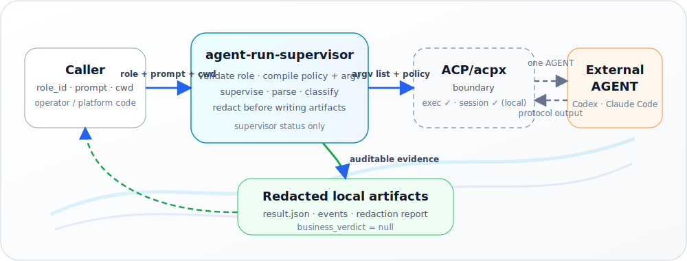

<!-- Hero -->
<p align="center">
  
</p>

<!-- Language links -->
<p align="center">
  <b>English</b>
  &nbsp;·&nbsp;
  <a href="README.zh-CN.md">简体中文</a>
</p>

<p align="center">
  <a href="https://github.com/jovijovi/agent-run-supervisor/actions/workflows/verify.yml">
    
  </a>
  <a href="https://codecov.io/gh/jovijovi/agent-run-supervisor">
    
  </a>
  <a href="https://pypi.org/project/agent-run-supervisor/">
    
  </a>
  <a href="https://pypi.org/project/agent-run-supervisor/">
    
  </a>
  <a href="LICENSE">
    
  </a>
</p>

<p align="center">
  A small, <b>local-first</b> Python library &amp; dev CLI that supervises<br>
  ACP/acpx external AGENT runs and turns runner behavior into <b>redacted, auditable evidence</b>.
</p>

---

> **Released vs. target.** The commands and APIs below describe the released **v0.1.7 acpx
> compatibility surface**. New development follows the vNext authority chain in [`GOAL.md`](GOAL.md),
> the [PRD](docs/product/prd.md), and [design](docs/design/architecture.md): unprivileged local `arsd`
> UDS ingress → ars-core/Native ACP → registered external AGENT. That target is staged and **not yet
> implemented or production-enabled**. Historical requirements/plans are retained only in cold archives.

## What it does

Every project that drives an external AGENT through **ACP/acpx** re-implements the same
plumbing: launching and babysitting the runner subprocess, compiling a permission policy,
parsing a stream of observed events, classifying exit behavior, and redacting artifacts
before anything touches disk. Done ad-hoc, each caller grows its own subtly-unsafe copy.

`agent-run-supervisor` factors that into one independent, **local** supervisor layer. A caller
picks a role, a prompt, and a working directory; the supervisor validates the role, compiles a
default-deny policy and a shell-free argv, supervises the run, parses observed output into
normalized events, classifies a **supervisor-owned status**, and writes **redacted,
restrictive-permission local artifacts**. The caller gets auditable evidence — not a tangle of
runner-lifecycle code.

The released v0.1.7 product covers **two local acpx execution modes**: one-shot exec and a local
persistent-session lifecycle (create/send/status/close/abort/list). That released line contains no
daemon. The separately staged vNext target adds a thin, unprivileged local `arsd` UDS host as the sole
production ingress; it is not implemented yet. Neither line is Sachima, a Gateway plugin, or an IM
adapter, and ARS never emits a business verdict (`business_verdict` is always `null`).

## How it works

<p align="center">
  
</p>

Four principles keep it honest:

- **Supervisor, not business judge.** Runner/protocol completion is never a business verdict;
  `business_verdict` stays `null` and caller-owned.
- **Auditable by default.** Runs produce deterministic, redacted artifacts with restrictive
  permissions (`0700` dirs, `0600` files, atomic final writes).
- **Fail closed on uncertainty.** Invalid roles, cwd-outside-roots, malformed stdout, protocol
  drift, denied permissions, and watchdog timeouts all resolve to deterministic non-success
  statuses — an invalid cwd creates **no** artifacts at all.
- **Honest security claims.** `allowed_roots` validates cwd/config **intent** only — it is
  **not** an OS/filesystem sandbox.

Out of scope — caller/platform territory: public ingress, real IM delivery, Gateway lifecycle,
production config writes, live/default-on behavior, `@all` fan-out, and agent-to-agent routing.

## Install and use

```bash
pip install agent-run-supervisor
```

Or install from a source checkout (see [Development](#development)).

### CLI

```bash
# Validate an AgentRoleSpec (JSON) and print its stable role hash
agent-run-supervisor validate-role <role-file>.json

# Replay an observed acpx stdout stream (deterministic, launches no AGENT)
# Source checkout: use repo fixtures (see note below).
# PyPI install: pass your own .ndjson path, or use `doctor` for built-in fixture replay.
agent-run-supervisor replay <events.ndjson>

# Probe local readiness (read-only, never launches an AGENT)
agent-run-supervisor doctor

# Dry-run: compile policy + argv and persist preview artifacts, launch nothing
agent-run-supervisor run \
  --role <role-file>.json --prompt-file <prompt>.txt --no-real-run

# Real one-shot exec: supervise a local `acpx exec` under the role's policy
# (requires acpx/Node available locally; launches ONE explicit, local AGENT)
agent-run-supervisor run \
  --role <role-file>.json --prompt-file <prompt>.txt

# Local persistent-session lifecycle (role must use a persistent session strategy):
# create → send turn(s) → status → close/abort. create/send/status/close/abort drive a
# real local acpx session and need Node + acpx; `session list` is local read-only and
# launches no AGENT.
agent-run-supervisor session create \
  --role <role-file>.json --session-id <id>
agent-run-supervisor session send \
  --role <role-file>.json --session-id <id> --prompt-file <prompt>.txt
# Or compile a validated goal turn from a goal file: adapters without a native
# ACP `/goal` command (all of them today) receive the goal-contract/v1 text template
agent-run-supervisor session send \
  --role <role-file>.json --session-id <id> --goal-file <goal>.txt
agent-run-supervisor session status \
  --role <role-file>.json --session-id <id>
agent-run-supervisor session close \
  --role <role-file>.json --session-id <id>
agent-run-supervisor session abort \
  --role <role-file>.json --session-id <id>
agent-run-supervisor session list

# Plan or apply local artifact retention/cleanup (dry-run by default; --apply deletes)
agent-run-supervisor cleanup
```

> **Fixture replay paths:** `fixtures/acpx-0.12.0/...` exist in the **git repository** only.
> The PyPI wheel bundles a minimal fixture for `doctor` smoke, not the full fixture tree.
> From a checkout you can run:
> `agent-run-supervisor replay fixtures/acpx-0.12.0/success-codex-sentinel/stdout.ndjson`

From a source checkout without installing, prefix commands with `PYTHONPATH=src python3 -m agent_run_supervisor` instead of `agent-run-supervisor`.

```bash
# Clone and enter the repository
git clone https://github.com/jovijovi/agent-run-supervisor.git
cd agent-run-supervisor

# Example: validate-role from checkout (no install)
PYTHONPATH=src python3 -m agent_run_supervisor validate-role <role-file>.json
```

### Codex/acpx smoke helper

For an explicit local connectivity check that exercises both supervised Codex surfaces —
one-shot exec first, then a two-turn persistent session — use the maintained helper:

```bash
python3 scripts/smoke_codex_acpx.py --model 'gpt-5.5[xhigh]'
```

The helper creates temporary no-tool roles, asks Codex for exact sentinel replies, verifies
`business_verdict = null`, closes the persistent session, and cleans artifacts by default
(`--keep-artifacts` keeps the temp scratch/runs/sessions directories). It intentionally uses
`runner.acpx_binary = null`, so the existing compiler invokes the pinned
`npx -y acpx@0.12.0` path.

Use the exact Codex ACP model IDs advertised by the ACP session, such as
`gpt-5.5[xhigh]`, `gpt-5.5[high]`, or `gpt-5.4-mini[medium]`. A bare id like
`gpt-5.5` can be rejected with `the ACP agent did not advertise that model`, and the
helper refuses it before launching anything.

Once installed (`pip install -e .`), the same surface is available as the
`agent-run-supervisor <command> …` console script.

Run artifacts land under `.agent-run-supervisor/runs/<run_id>/` — redacted prompt/env/argv, the
generated policy, observed stdout (NDJSON), normalized events, stderr, `result.json`
(`business_verdict = null`), and `redaction-report.json`. Persistent-session artifacts land under
`.agent-run-supervisor/sessions/<session_id>/` (local record, redacted `management/` summaries,
and one redacted `turns/<turn_id>/` directory per send). The `cleanup` command plans and (only
with `--apply`) deletes aged run/session artifacts, confined to the resolved
`.agent-run-supervisor` root and never touching open/live-locked sessions.

## Library usage

The released package is a **Python library** as well as a CLI. For v0.1.7 programmatic integration,
prefer the generic local caller boundary ([`caller.py`](src/agent_run_supervisor/caller.py)); the
caller-stable payload contract is documented in
[`docs/design/result-event-schema.md`](docs/design/result-event-schema.md).

**Install:**

```bash
pip install agent-run-supervisor
```

**Recommended API:** `invoke_caller` + `CallerInvocationSpec`. The supervisor returns a
supervisor-owned status and redacted artifacts; `business_verdict` is always `null` — your
application interprets success/failure.

```python
from agent_run_supervisor.caller import CallerInvocationSpec, invoke_caller

# One-shot exec (launches a real local AGENT when not dry-run)
result = invoke_caller(
    CallerInvocationSpec(
        mode="exec",
        role_file="reviewer.json",
        prompt="Summarize the diff in plain language.",
        cwd="/path/to/repo",
    )
)
print(result.supervisor_status)  # e.g. "completed"
print(result.result)             # result.json payload (dict)
print(result.run_dir)            # redacted artifact directory
assert result.business_verdict is None

# Dry-run compile/preview only — no subprocess, no AGENT
preview = invoke_caller(
    CallerInvocationSpec(
        mode="exec_dry_run",
        role_file="reviewer.json",
        prompt="Preview only.",
        cwd="/path/to/repo",
    )
)
print(preview.artifact_dir)
```

**Persistent session** (role must use `strategy: persistent`):

```python
session_id = "my-local-session"

invoke_caller(
    CallerInvocationSpec(
        mode="session_create",
        role_file="reviewer.json",
        session_id=session_id,
        cwd="/path/to/repo",
    )
)
turn = invoke_caller(
    CallerInvocationSpec(
        mode="session_send",
        role_file="reviewer.json",
        session_id=session_id,
        prompt="Continue from the previous turn.",
        cwd="/path/to/repo",
    )
)
print(turn.session_dir)
```

Supported modes: `exec`, `exec_dry_run`, `session_create`, `session_send`, `session_status`,
`session_close`, `session_abort`, `session_list`.

**Lower-level surfaces** (advanced): `SupervisorRunner`, `SessionRuntime`, `parse_acpx_stdout_bytes`.
Inject a fake subprocess executor in tests — see [`tests/test_caller.py`](tests/test_caller.py).

**Reference caller:** [`hermes_caller`](src/agent_run_supervisor/hermes_caller/) shows a concrete
document-check integration with caller-owned verdicts and view-models (local/offline only).

### Live progress polling (advanced)

During **exec** or **session_send**, the supervisor writes `progress.json` and seq-stamped
`normalized-events.jsonl` while the child is still running. `result.json` remains the final
authority after the run completes.

Poll structural progress only (no raw agent text) via [`hermes_caller.events`](src/agent_run_supervisor/hermes_caller/events.py):

```python
from agent_run_supervisor.caller import CallerInvocationSpec, invoke_caller
from agent_run_supervisor.hermes_caller.events import load_progress, read_event_page

# invoke_caller is blocking; poll artifact_dir from another thread while it runs,
# or read artifacts after it returns.
result = invoke_caller(
    CallerInvocationSpec(
        mode="exec",
        role_file="reviewer.json",
        prompt="Summarize the diff.",
        cwd="/path/to/repo",
    )
)

# Structural fields only (no raw agent text)
snap = load_progress(result.run_dir)
if snap:
    print(snap.state, snap.last_seq, snap.event_count)

# Page through normalized-events.jsonl by seq cursor
page = read_event_page(result.run_dir, after_seq=0, limit=50)
for event in page.records:
    print(event.seq, event.kind, event.text_length)
```

**Boundaries:**

- Applies to artifact directories from **exec** and **session_send** turns.
- `session_abort` cancels an in-flight turn; `session_list` enumerates local session records
  read-only (optionally filtered by role).
- Local read API only — no websocket, long-poll server, or IM delivery (see
  [`docs/roadmap/non-approvals.md`](docs/roadmap/non-approvals.md)).
- Schema detail: [`docs/design/result-event-schema.md`](docs/design/result-event-schema.md) §4.

**Schema stability:** Public API and result schemas may evolve; read
[`docs/design/result-event-schema.md`](docs/design/result-event-schema.md) for `result.json`
fields.

### Read-only session inspection (no subprocess)

For liveness/health checks over an existing **persistent session**, use
[`session_inspect`](src/agent_run_supervisor/session_inspect.py): it reads only local artifacts
(the session record, the lease lock, turn artifacts) and never spawns acpx or an AGENT, so it is
safe on a caller's hot polling path. `session_status` remains the acpx-side `status -s`
management query; inspection is its non-spawning local complement.

```python
from agent_run_supervisor.session_inspect import inspect_session, list_turns

inspection = inspect_session("/path/to/sessions", "nightly-review")
print(inspection.exists, inspection.state)                # True "open"
print(inspection.lease_held, inspection.holder_liveness)  # e.g. True "alive"
print(inspection.latest_turn_status)                      # e.g. "completed" (None while in flight)
if inspection.progress:
    print(inspection.progress.state, inspection.progress.last_seq)

for turn in list_turns("/path/to/sessions", "nightly-review"):
    print(turn.turn_id, turn.status)  # turn.turn_dir is a caller-private path
```

- A missing session reports `exists=False`; corrupt/off-vocabulary artifacts degrade to
  `None`/`unknown` — never fabricated health, never raw agent text.
- Lease fields follow the store's stale-lock semantics: `lease_held` means a present,
  not-provably-expired lease; `holder_liveness` is the crash-recovery classification;
  `lease_recoverable` means TTL-expired or provably crashed.

## Environment requirements

| Need | Requirement |
|---|---|
| Runtime | **Python ≥ 3.11**, standard-library only — zero third-party runtime dependencies. |
| Tests (optional) | `pytest >= 8, < 10` (the `dev` extra). |
| Real AGENT runs / session turns | **Node + acpx + the target AGENT CLI** available locally — required for `run` (without `--no-real-run`) and for the real `session create/send/status/close/abort` turn & management commands. The Codex smoke helper specifically needs `npx` plus Codex CLI via `CODEX_PATH` or `PATH`. |
| No-AGENT commands | `validate-role`, `replay`, `doctor`, `run --no-real-run`, `session list`, and `cleanup` (dry-run) need **no** Node/acpx and launch **no** AGENT. |

## Development

Primary path uses [uv](https://docs.astral.sh/uv/) for a reproducible dev environment.
Short commands are available via the root [`Makefile`](Makefile):

```bash
git clone https://github.com/jovijovi/agent-run-supervisor.git
cd agent-run-supervisor
make sync      # uv sync --extra dev --extra release
make verify    # full local gates (same as CI)
make build     # sdist/wheel + twine check
make smoke     # build + installed-wheel smoke
make clean     # remove build artifacts, caches, local scratch data
make help      # list all targets
```

Equivalent without Make:

```bash
uv sync --extra dev --extra release
./scripts/verify_local.sh
```

`make verify` / `./scripts/verify_local.sh` is the single local gate entry — it mirrors CI and
[`docs/roadmap/verification.md`](docs/roadmap/verification.md) (tests, doctor/replay smoke,
docs index/drift, static safety scan, build/twine check, and installed-wheel smoke).

**pip fallback** (without uv):

```bash
pip install -e '.[dev,release]'
python3 -m pytest -q
```

## Publishing

Releases are published to PyPI and GitHub via tag-triggered GitHub Actions Trusted Publishing
(no API tokens in the repo).

**Release process** (maintainers):

```bash
make bump VERSION=X.Y.Z   # sync pyproject.toml, __init__.py, uv.lock, CHANGELOG stub
# edit CHANGELOG [X.Y.Z] section content
make verify              # or ./scripts/verify_local.sh
# merge bump PR to main
make release-tag         # prints git tag vX.Y.Z && git push commands
agent-run-supervisor doctor   # after pip install from PyPI
```

Trusted Publishing uses workflow [`release.yml`](.github/workflows/release.yml) and GitHub
environment `pypi`. See [`docs/plans/archive/2026-07-06-p3-engineering-basics.md`](docs/plans/archive/2026-07-06-p3-engineering-basics.md)
for the operator checklist.

Each GitHub Release for tag `v*` uploads `dist/*.tar.gz`, `dist/*.whl`, and
`dist/SHA256SUMS`. Verify a wheel locally:

```bash
curl -LO https://github.com/jovijovi/agent-run-supervisor/releases/download/vX.Y.Z/SHA256SUMS
curl -LO https://github.com/jovijovi/agent-run-supervisor/releases/download/vX.Y.Z/agent_run_supervisor-X.Y.Z-py3-none-any.whl
sha256sum -c SHA256SUMS --ignore-missing
```

**TestPyPI dry-run** (local upload with API token in env — never commit tokens):

```bash
export TWINE_USERNAME=__token__
export TWINE_PASSWORD=pypi-...    # TestPyPI token
make release-test                 # verify + upload to TestPyPI

pip install --index-url https://test.pypi.org/simple/ \
            --extra-index-url https://pypi.org/simple/ \
            agent-run-supervisor
agent-run-supervisor doctor
```

## Quality and test indicators

Factual local gates that keep the supervisor honest (run from the repository root with
`./scripts/verify_local.sh`, or step-by-step):

| Indicator | Evidence |
|---|---|
| Full local gate | `make verify` or `./scripts/verify_local.sh` — mirrors CI verify workflow. |
| Unit / integration tests | **Full pytest suite** — `uv run pytest -q` (current local acceptance: full suite passing). |
| acpx contract | acpx `0.12.0` fixtures + validator — `scripts/validate_contract_fixtures.py fixtures/acpx-0.12.0`. |
| Import / syntax smoke | `python -m compileall -q src scripts tests`. |
| Doctor (read-only) | `… doctor` never launches an AGENT (`launched_real_agent = false`). |
| Package checks | `python -m build` + `twine check dist/*`, plus an installed-wheel `agent-run-supervisor doctor` smoke. |
| Safe artifacts | Redacted artifacts · `business_verdict = null` · EventStore `0700`/`0600` atomic NDJSON. |

```bash
uv sync --extra dev --extra release
./scripts/verify_local.sh
```

## Roadmap

The released v0.1.7 surface and the vNext target are deliberately separate. Current authority, stage
status, gates, and non-approvals live in [`docs/roadmap/current-status.md`](docs/roadmap/current-status.md),
[`docs/roadmap/features.md`](docs/roadmap/features.md), and
[`docs/roadmap/non-approvals.md`](docs/roadmap/non-approvals.md).

- **Released compatibility baseline — v0.1.7.** Local acpx one-shot/persistent-session supervision,
  redacted evidence, doctor/cleanup, caller wrapper, packaging, and release engineering are implemented.
  They remain supported compatibility surfaces, not the architecture for new development.
- **Planned — vNext Stage 0/1.** AgentProfile/immutable RunSpec, ManagedProcess, Native ACP exact config,
  process-per-Run Session load/switching, isolated Native stores, fail-closed state, permissions, and
  B-grade real OpenCode evidence. Source/dependency implementation requires separate approval; see the
  [active plan](docs/plans/active/2026-07-21-vnext-stage01-native-acp-implementation.md).
- **Planned — vNext Stage 2.** `arsd` UDS ingress, peer ownership, reconciliation, bounded operation,
  real denied-action mediation, and cgroup crash containment. G12 caller-UID policy and all production
  enablement require separate approval.
- **Parked — Sachima integration.** A socket backend comes only after ARS production acceptance and a
  separate integration authorization. Public ingress, IM/Gateway behavior, and business orchestration
  remain out of ARS scope.

## License

© the `agent-run-supervisor` authors. Released under the **[MIT](https://opensource.org/license/mit)**
license (`license = "MIT"` and [`LICENSE`](LICENSE)).
