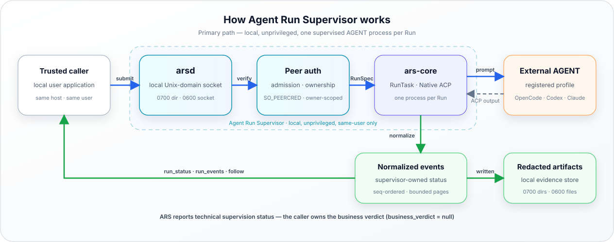

<!-- Hero -->
<p align="center">
  
</p>

<!-- Language links -->
<p align="center">
  <b>English</b>
  &nbsp;·&nbsp;
  <a href="README.zh-CN.md">简体中文</a>
</p>

<!-- Badges -->
<p align="center">
  <a href="https://github.com/jovijovi/agent-run-supervisor/actions/workflows/verify.yml">
    
  </a>
  <a href="https://codecov.io/gh/jovijovi/agent-run-supervisor">
    
  </a>
  <a href="https://pypi.org/project/agent-run-supervisor/">
    
  </a>
  <a href="LICENSE">
    
  </a>
</p>

<p align="center">
  A <b>local-first</b> supervisor for external coding AGENTs.<br>
  One unprivileged daemon, one process per run, <b>redacted and auditable</b> local evidence.
</p>

---

## What it is

Anything that drives an external coding AGENT rebuilds the same plumbing: launch the agent process,
babysit it, decide what it may touch, read a stream of protocol events, work out how the run really
ended, and scrub secrets before anything hits disk. Written ad-hoc, every caller grows its own copy.

**Agent Run Supervisor (ARS)** is that layer, factored out and kept local. Your application submits a
run — which registered agent, which model, which workspace, which prompt — and ARS launches exactly one
supervised process from the command an operator registered, mediates every permission request
default-deny, normalizes agent output into ordered events, classifies a supervisor-owned status, and
writes redacted artifacts. You get **auditable evidence** instead of process-lifecycle code: *what did
the agent try to do, what was it allowed to do, how did it end?*

| ARS owns | ARS deliberately does not own |
|---|---|
| the process it starts: PID/PGID, timeouts, signals, reap | the software it starts — you install and upgrade agents yourself |
| the ACP conversation: capabilities, exact model/effort, continuity | the agent's own conversation and context state |
| permission mediation against a caller-frozen grant | the business verdict, which stays with your application |
| redacted per-run evidence under one supervisor root | agent `$HOME`, auth stores, plugins, caches, config |
| caller authentication over a local socket | credentials — ARS resolves, mints, refreshes, and stores none |

## How it works

<p align="center">
  
</p>

```text
trusted caller  →  arsd (local UDS)  →  ars-core / Native ACP  →  external AGENT process
```

Every hop is on one machine, under one unprivileged user:

1. **`arsd` starts:** parse the agent registry exactly once → reconcile durable run/session facts →
   *then* bind the socket. Any registry defect refuses to listen before anything is written.
2. **Your application connects** to a `0600` socket inside a `0700` directory — no TCP, no root, no
   public ingress. `arsd` authenticates peer credentials, maps them to a principal, and keys admission
   on your own `request_id`, which doubles as the idempotency key. Runs and sessions are owner-scoped.
3. **`ars-core` runs the work:** one in-process `RunTask` owning one supervised process and one Native
   ACP connection, driven by an immutable spec sealed before spawn. The agent is the command you
   registered, launched exactly as declared — no command, argv, or environment ever comes from the wire,
   and the registry is never re-read while serving.

Back over the same socket come normalized `seq`-ordered events, a supervisor-owned status, and redacted
local artifacts.

**Two protocols, two version lines — neither implies the other.** *Downstream*, ARS speaks **ACP
Protocol v1** over stdio JSON-RPC to the agent. *Upstream*, your application speaks the ARS-owned
**`arsd` API v2**: every *request* envelope your client sends carries `api_version`, and an unknown one
is refused rather than guessed. Result and error frames carry the correlating `request_id`, not a
version. `submit` is served only at `api_version: 2`, where `agent_id` names the launch; the other seven
operations, including `server_info`, are served at `api_version: 1` as well.

## Requirements

| Need | Requirement |
|---|---|
| Runtime | **Python ≥ 3.11**, with **zero third-party runtime dependencies**. |
| Driving a real agent | The `native` extra, pinning the official ACP client `agent-client-protocol==0.12.0`. A base install imports fine and fails only when the SDK is used. ARS is stdio ACP only and never installs the SDK's `http` extra. |
| Running `arsd` | Linux with a POSIX user session for the AF_UNIX socket, plus a supervisor root, an agents file, and at least one caller mapping you supply. Crash containment additionally expects a user-level service manager cgroup and a CPython build with pidfd support. |
| Running an agent | The agent installed by you, plus one registry entry naming its command. |

## Install and quick start

```bash
pip install 'agent-run-supervisor[native]'      # or: uv pip install 'agent-run-supervisor[native]'
```

Since the runtime is standard library only, a source checkout runs without installing anything:

```bash
git clone https://github.com/jovijovi/agent-run-supervisor.git
cd agent-run-supervisor
PYTHONPATH=src python3 -m agent_run_supervisor --help
# write a small agents file first (next section), then check it — read-only
PYTHONPATH=src python3 -m agent_run_supervisor agents validate --agents-file <your-agents.toml>
```

For the test suite and dev tooling: `pip install -e '.[dev,native]'`, or `make sync` with
[uv](https://docs.astral.sh/uv/). Nothing here launches an agent implicitly: `agents validate`,
`run inspect`, and `--print-service-unit` are read-only. `agents doctor` is the one diagnostic that
*does* start an external child, which writes its own agent-owned state; it is reaped on every path, and
a group surviving `SIGTERM` and `SIGKILL` is reported as a failed probe rather than left running.

## The agent registry

`--agents-file` points at **one operator-owned TOML file, read exactly once at daemon startup** into an
immutable in-memory snapshot. Replace it atomically; a replacement takes effect at the next daemon start.

```toml
schema_version = 1

[agents.native-agent]                              # table key = the agent_id a caller names
profile         = "standard-native-acp-v1"         # how to speak ACP; not an agent list
command         = "some-agent"                     # bare name → PATH, or an absolute path
args            = ["acp"]
mediation       = "ask-privileged-tool-families-v1"  # selects a source-owned binding
env_passthrough = ["SSH_AUTH_SOCK", "SOME_PROVIDER_TOKEN"]
env_overlay     = { SOME_AGENT_HOME = "/home/<service-user>/.some-agent" }
forbidden_capabilities = ["terminal"]
```

Every value above is a **placeholder**. The closed field set is `profile`, `command`, `args`,
`mediation`, `env_passthrough`, `env_overlay`, `model_selector`, `effort_selector`,
`forbidden_capabilities`, and `session_epoch` — nothing else, and an unknown key at any level is
refused. An agent whose CLI is not natively ACP is no different: point `command` at the ACP adapter you
installed and use the same profile, because the adapter is a deployment fact, not a source constant.
Two profiles differ, each for one evidenced deviation and nothing more:
`claude-agent-acp-compat-v1` carries its ACP-level compatibility differences, and
`cursor-native-acp-v1` uses model-only configuration fidelity plus a source-owned read-only
startup permission policy. `standard-native-acp-v1` behaves ordinarily.

- **Your command is launched exactly as declared.** `argv[0]` is the declared string byte-for-byte, and
  a bare name is found by ordinary PATH lookup over the *child's* projected `PATH`, so shims, symlink
  farms, and agent self-update keep working. There is no pre-flight resolution check; a failed exec
  reports `COMMAND_NOT_FOUND`, `COMMAND_NOT_EXECUTABLE`, or `SPAWN_FAILED` — configuration errors, not
  security refusals.
- **`PATH` is the usual cause of "works in my shell, fails under ARS."** A user daemon inherits a
  minimal environment, so declare what your agent needs. `SSH_AUTH_SOCK` is opt-in on purpose:
  forwarding it hands the agent live use of your SSH keys.
- **Read-once has a price and a payoff.** A registry edit costs one daemon restart; an *agent upgrade
  behind an unchanged registered command* costs nothing at all, and existing sessions still resume
  through a real `session/load`.

ARS checks its own configuration file and nothing beyond it: the resolved agents file must be a regular
file that is not group- or world-writable, and there is **no ownership, mode, ancestor, symlink, or
digest check on `command`** or on anything the agent later loads. Full contract — grammar, bounds,
refusal codes, environment layers, `session_epoch`, honest limits: [`docs/design/agent-registry.md`](docs/design/agent-registry.md).

## Run `arsd`

Operator commands are on the `agent-run-supervisor` script; the daemon is a module entry point. In order:

```bash
# 1. check the file offline — no side effects
agent-run-supervisor agents validate --agents-file <agents-file>
# 2. per-agent diagnostics; without --no-probe this starts the registered command
agent-run-supervisor agents doctor --agents-file <agents-file> --agent <agent-id>
# 3. render a user-scope systemd unit to stdout — pure text, installs nothing
python3 -m agent_run_supervisor.arsd --agents-file /absolute/path/to/agents.toml --print-service-unit
# 4. start the daemon
python3 -m agent_run_supervisor.arsd \
  --supervisor-root <supervisor-root> \
  --agents-file /absolute/path/to/agents.toml \
  --caller-mapping <UID>:<principal_id>:<owner>:<namespace>
```

Between steps 2 and 3, run the **mandatory denied-action mediation canary** for each agent: mediation is
cooperative-agent policy, not an OS sandbox, and zero permission events prove nothing about denial.

`--agents-file` must be an **absolute** path in both `--print-service-unit` and daemon mode — the same
check runs either way, so a rendered unit can never carry a path the daemon would reject. Daemon mode
additionally requires `--supervisor-root` and at least one `--caller-mapping` — **zero mappings refuse
to listen** — and refuses to run as root. `--socket` defaults to
`$XDG_RUNTIME_DIR/agent-run-supervisor/arsd.sock`, falling back to `<supervisor-root>/arsd/arsd.sock`.
Caller mappings, socket paths, and the registry path are deployment values: keep them in a mode-`0600`
unit file, never in a repository. On restart the daemon reconciles durable facts only and never
re-prompts — and is stricter than a tolerant reader: a corrupt terminal record, unattributable
uncertainty, or a launch record without its spec each refuse to listen, and a run that may have been
dispatched without a trustworthy terminal result ends `unknown` / `quarantined` / `retryable=false`.

## Use from Python

[`ArsdClient`](src/agent_run_supervisor/arsd/client.py) is the supported caller boundary: explicitly connected, context-managed, never silently reconnecting, never replaying a request.

```python
from agent_run_supervisor.arsd.client import ArsdClient

socket_path = "<XDG_RUNTIME_DIR>/agent-run-supervisor/arsd.sock"

with ArsdClient(socket_path) as client:
    client.server_info()                      # protocol/version handshake facts

    # Placeholders. Replace owner/namespace/agent, model/effort, the grant and
    # policy hashes, and the input refs with values from your own admission and
    # grant pipeline; a configured daemon will refuse these as-is.
    ack = client.submit(                      # caller-owned request_id = idempotency key
        request_id="my-caller-request-id",
        payload={
            "request": {
                "owner": "my-team",
                "namespace": "my-team/docs",
                "agent_id": "native-agent",           # an agent_id in your registry
                "session_reuse": "none",              # "none" starts a new Session
                "ars_session_id": None,               # set with session_reuse="reuse"
                "expected_binding_hash": None,
                "input_refs": [
                    {"ref": "prompt:inline", "content_hash": "sha256:" + "a" * 64},
                ],
                "requested_model": "<model-the-agent-advertises>",
                "requested_effort": "<effort-the-agent-advertises>",
                "grant_ref": "grant:my-caller-grant-1",
                "grant_hash": "sha256:" + "b" * 64,
                "grant_role_hash": "sha256:" + "c" * 64,
                "grant_capabilities": ["read"],
                "mcp_snapshot_hashes": [],
                "credential_refs": [],
                "limits": {},                         # {} takes the sealed defaults
                "evidence_policy_hash": "sha256:" + "d" * 64,
                "recovery_policy_hash": "sha256:" + "e" * 64,
            },
            "prompt_text": "Summarize the diff in plain language.",
            "workspace_root": "/path/to/bound/workspace",
        },
    )
    run_id = ack["run_id"]                    # ack is {"run_id": ..., "accepted_at": ...}

    client.run_status(run_id)                          # accepted → progress → one terminal result
    client.run_events(run_id, from_seq=0, limit=100)   # bounded, seq-ordered page
    client.run_cancel(run_id)                          # cooperative; never rewrites a terminal fact

    with client.run_events(run_id, follow=True) as stream:   # live event frames
        for frame in stream:
            ...
```

`session_list()`, `session_status(id)`, and `session_close(id)` round out the surface, all owner-scoped.
The `request` key set above is closed and complete: unknown keys are refused, and there is no shell text,
argv, environment value, executable path, or credential material on it — those fields do not exist on the
wire, and `credential_refs` are *references* ARS never resolves to values. Errors are typed and fail
closed: exceptions carry a stable code such as `PEER_UID_DENIED`, `OWNER_MISMATCH`,
`IDEMPOTENCY_CONFLICT`, or `CAPACITY_EXHAUSTED`, and server-side text is never echoed back into one.

## Guarantees and boundaries

| ARS guarantees | ARS does not claim |
|---|---|
| default-deny mediation against the caller's frozen grant, with redacted evidence for every decision; the mediation environment binding is source-owned in key *and* value, applied last, and never authored or disabled by an entry | **a sandbox.** This is cooperative-agent policy, not OS isolation: the agent runs as the daemon's UID with that UID's full authority |
| no projected environment value serialized out of the resolved carrier into structured launch/Spec/environment material, any hash input, or a configuration-inspection response — not a digest, fingerprint, or length of one; the carrier goes to exec and nowhere else | that an environment value never appears in Run evidence. ARS does **not** scan free-form agent text against the values it projected, so an agent that echoes one back may have it retained in bounded Run/Session evidence unless static credential-shape or sensitive-key redaction catches it |
| deterministic redacted artifacts: `0700` directories, `0600` files, atomic final writes, and exactly two writable surfaces — the supervisor root and the socket path | **integrity or supply-chain verification.** ARS does not check that the executable it launched is the one you intended or came from a trusted publisher |
| termination of its direct child and every descendant still in the process group ARS created | **a complete kill switch.** A descendant that leaves the group is outside it — and when work continues elsewhere, the run fails loudly as `unknown` / `quarantined` |
| fail-closed uncertainty: no auto-retry, replay, or resume of a prompt that may already have been dispatched, and no unquarantine tool | **crash containment by itself.** Production expects a user-level service manager cgroup (`Restart=on-failure`, `KillMode=control-group`) |
| technical supervision facts only — `business_verdict` is always `null` and belongs to the caller | **credential management, ingress, gateway, or chat integration.** Agents authenticate through their own stores under their own `HOME` |

Real isolation belongs at the OS layer — dedicated UID, user namespaces, `seccomp`/Landlock, `bwrap`/container/VM boundaries, cgroup limits — and composes here: register the wrapper as the command.

## Documentation

| Read | For |
|---|---|
| [`docs/design/agent-registry.md`](docs/design/agent-registry.md) | the operator contract: grammar, bounds, refusal codes, environment layers, restart semantics |
| [`docs/design/architecture.md`](docs/design/architecture.md) | system shape, the four authority layers, reconciliation, storage |
| [`docs/design/result-event-schema.md`](docs/design/result-event-schema.md) | the caller-stable JSON shapes ARS emits |
| [`docs/roadmap/current-status.md`](docs/roadmap/current-status.md) | where the project actually is, and what is not approved |

## Development

```bash
make sync      # uv sync --locked --extra dev --extra release --extra native
make verify    # the single local gate — identical to CI
make build     # sdist/wheel + twine check
make help      # list all targets
```

Without Make: `uv sync --locked --extra dev --extra release --extra native` then
`./scripts/verify_local.sh`; without [uv](https://docs.astral.sh/uv/):
`pip install -e '.[dev,release,native]'` then `python3 -m pytest -q`. `make verify` runs tests,
read-only CLI smoke, docs index checks, a static safety scan, and package checks — see
[`docs/roadmap/verification.md`](docs/roadmap/verification.md). The suite drives the Native ACP core and
`arsd` against a hermetic fake agent over temporary sockets; suites needing a real agent runtime are
opt-in and never run in CI.

## Contributing

Issues and pull requests are welcome. Documentation precedes code here, so read the authority chain
first: [`GOAL.md`](GOAL.md) → [`docs/product/prd.md`](docs/product/prd.md) →
[`docs/design/`](docs/design/) → [`docs/roadmap/`](docs/roadmap/), where
[`non-approvals.md`](docs/roadmap/non-approvals.md) records what is explicitly out of scope; anything
under `docs/archive/` is cold history, never current authority.

Branch from `main` with a short-lived `feat/` · `fix/` · `docs/` · `cicd/` branch, write the test first,
keep the runtime standard-library only, make `make verify` green before opening a PR, use Conventional
Commits, and **never commit secrets** — no keys, tokens, real UID mappings, socket paths, or other
deployment values; use `[REDACTED]` in docs and examples. Full process:
[`docs/AI_FLOW.md`](docs/AI_FLOW.md).

## License

© the `agent-run-supervisor` authors. Released under the **[MIT](https://opensource.org/license/mit)** license — see [`LICENSE`](LICENSE).
