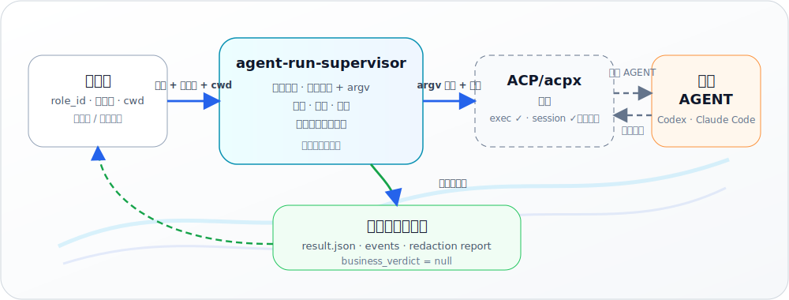

<!-- Hero -->
<p align="center">
  
</p>

<!-- Language links -->
<p align="center">
  <a href="README.md">English</a>
  &nbsp;·&nbsp;
  <b>简体中文</b>
</p>

<p align="center">
  一个小而<b>本地优先</b>的 Python 库与开发 CLI，用于监督<br>
  ACP/acpx 外部 AGENT 运行，并将运行器行为转化为<b>脱敏、可审计的证据</b>。
</p>

<p align="center">
  <code>Python&nbsp;≥&nbsp;3.11</code>
  &nbsp;·&nbsp;
  <code>仅标准库</code>
  &nbsp;·&nbsp;
  <code>本地优先</code>
  &nbsp;·&nbsp;
  <code>MIT</code>
  &nbsp;·&nbsp;
  <code>状态：0.1.0</code>
</p>

---

## 它做什么

每一个通过 **ACP/acpx** 驱动外部 AGENT 的项目，最终都会重复实现同一套底层管道：拉起并照看
运行器子进程、编译权限策略、解析观测到的事件流、对退出行为进行分类，并在任何内容落盘之前完成
脱敏。一旦各自为政，每个调用方都会长出自己那份略不安全的副本。

`agent-run-supervisor` 将这套管道收敛为一个独立的**本地**监督层。调用方只需选择角色、提示词与
工作目录；监督层负责校验角色、编译默认拒绝（default-deny）的策略与免 shell 的 argv、监督运行、
将观测输出解析为归一化事件、判定一个**由监督层拥有的状态**，并写出**脱敏、权限受限的本地工件**。
调用方拿到的是可审计的证据 —— 而不是一团运行器生命周期代码。

本产品包含**两种执行模式**，二者均已为本地使用实现：一次性 exec 与本地持久会话生命周期
（创建/发送/状态/关闭/中止/列举 —— 见 [路线图](#路线图)）。它刻意**不是** Sachima、不是 Gateway
插件、不是 IM 适配器，也不是常驻守护进程（daemon），并且永不给出业务结论（`business_verdict`
始终为 `null`）。

## 工作原理

<p align="center">
  
</p>

四条原则保持其诚实：

- **是监督者，不是业务裁判。** 运行器/协议层面的完成永远不等于业务结论；`business_verdict`
  始终为 `null`，归调用方所有。
- **默认可审计。** 运行会产出确定性的、脱敏的工件，并采用受限权限（目录 `0700`、文件 `0600`、
  最终工件原子写入）。
- **不确定即失败关闭（fail closed）。** 无效角色、cwd 越出允许根、stdout 畸形、协议漂移、权限
  被拒、看门狗超时，都会判定为确定性的非成功状态 —— cwd 无效时**根本不会**创建任何工件。
- **诚实的安全声明。** `allowed_roots` 只校验 cwd/配置的**意图**，它**不是**操作系统/文件系统沙箱。

不在范围内 —— 属于调用方/平台领域：公网入口、真实 IM 投递、Gateway 生命周期、生产配置写入、
默认开启/常驻行为、`@all` 扇出，以及 agent 间自动路由。

## 安装与使用

```bash
pip install agent-run-supervisor
```

或从源码检出运行（见 [开发](#开发)）。

```bash
# 校验一个 AgentRoleSpec（JSON）并打印其稳定的 role hash
agent-run-supervisor validate-role <role-file>.json

# 将观测到的 acpx stdout 流经解析器回放（确定性，不启动任何 AGENT）
agent-run-supervisor replay \
  fixtures/acpx-0.12.0/success-codex-sentinel/stdout.ndjson

# 探测本地就绪状态（只读，绝不启动 AGENT）
agent-run-supervisor doctor

# 干跑（dry-run）：编译策略 + argv 并持久化预览工件，不启动任何进程
agent-run-supervisor run \
  --role <role-file>.json --prompt-file <prompt>.txt --no-real-run

# 真实的一次性 exec：在角色策略下监督一次本地 `acpx exec`
#（需要本地具备 acpx/Node；仅启动一个显式、本地的 AGENT）
agent-run-supervisor run \
  --role <role-file>.json --prompt-file <prompt>.txt

# 本地持久会话生命周期（角色须使用持久会话策略）：
# 创建 → 发送轮次 → 状态 → 关闭/中止。create/send/status/close/abort 会驱动一次真实的本地
# acpx 会话，需要本地具备 Node + acpx；`session list` 为本地只读枚举，不启动任何 AGENT。
agent-run-supervisor session create \
  --role <role-file>.json --session-id <id>
agent-run-supervisor session send \
  --role <role-file>.json --session-id <id> --prompt-file <prompt>.txt
agent-run-supervisor session status \
  --role <role-file>.json --session-id <id>
agent-run-supervisor session close \
  --role <role-file>.json --session-id <id>
agent-run-supervisor session abort \
  --role <role-file>.json --session-id <id>
agent-run-supervisor session list

# 规划或执行本地工件的保留/清理（默认 dry-run；--apply 才真正删除）
agent-run-supervisor cleanup
```

未安装时从源码检出运行，将 `agent-run-supervisor` 替换为
`PYTHONPATH=src python3 -m agent_run_supervisor`。

```bash
# 克隆并进入仓库
git clone https://github.com/jovijovi/agent-run-supervisor.git
cd agent-run-supervisor

# 示例：从检出运行 validate-role（无需安装）
PYTHONPATH=src python3 -m agent_run_supervisor validate-role <role-file>.json
```

### Codex/acpx 冒烟 helper

如果要显式检查本地 Codex 链路，并同时覆盖两个受监督表面 —— 先跑一次性 exec，
再跑两轮持久会话 —— 使用维护好的 helper：

```bash
python3 scripts/smoke_codex_acpx.py --model 'gpt-5.5[xhigh]'
```

该 helper 会创建临时 no-tool 角色，要求 Codex 回复精确 sentinel，校验
`business_verdict = null`，关闭持久会话，并默认清理临时工件（`--keep-artifacts`
会保留 temp scratch/runs/sessions 目录）。它刻意使用 `runner.acpx_binary = null`，
因此会走现有编译器的固定 `npx -y acpx@0.12.0` 路径。

Codex ACP 模型名要使用 ACP session 广告出来的精确 ID，例如 `gpt-5.5[xhigh]`、
`gpt-5.5[high]` 或 `gpt-5.4-mini[medium]`。裸 ID（如 `gpt-5.5`）可能被拒绝并报
`the ACP agent did not advertise that model`；helper 会在启动任何东西前拒绝这种写法。

安装本包后（`pip install -e .`），同样的接口也可通过 `agent-run-supervisor <command> …`
控制台脚本使用。

运行工件写入 `.agent-run-supervisor/runs/<run_id>/` —— 包括脱敏后的 prompt/env/argv、生成的
策略、观测 stdout（NDJSON）、归一化事件、stderr、`result.json`（`business_verdict = null`）以及
`redaction-report.json`。持久会话工件写入 `.agent-run-supervisor/sessions/<session_id>/`（本地
记录、脱敏的 `management/` 摘要，以及每次 send 一个脱敏的 `turns/<turn_id>/` 目录）。`cleanup`
命令会规划并（仅在 `--apply` 时）删除过期的运行/会话工件，删除范围被限制在解析出的
`.agent-run-supervisor` 根目录内，且绝不触碰处于打开/活动锁定状态的会话。

## 环境要求

| 需求 | 要求 |
|---|---|
| 运行时 | **Python ≥ 3.11**，仅标准库 —— 零第三方运行时依赖。 |
| 测试（可选） | `pytest >= 8, < 10`（`dev` 额外依赖）。 |
| 真实 AGENT 运行 / 会话轮次 | 本地具备 **Node + acpx + 目标 AGENT CLI** —— 在不带 `--no-real-run` 的 `run`，以及真实的 `session create/send/status/close/abort` 轮次与管理命令时需要。Codex 冒烟 helper 还需要 `npx`，以及通过 `CODEX_PATH` 或 `PATH` 可用的 Codex CLI。 |
| 不启动 AGENT 的命令 | `validate-role`、`replay`、`doctor`、`run --no-real-run`、`session list` 与 `cleanup`（dry-run）**无需** Node/acpx，且**不启动**任何 AGENT。 |

## 开发

推荐使用 [uv](https://docs.astral.sh/uv/) 获得可复现的开发环境。根目录 [`Makefile`](Makefile)
提供快捷命令：

```bash
git clone https://github.com/jovijovi/agent-run-supervisor.git
cd agent-run-supervisor
make sync      # uv sync --extra dev --extra release
make verify    # 完整本地关卡（与 CI 一致）
make build     # sdist/wheel + twine check
make smoke     # build + 已安装 wheel 冒烟
make clean     # 清理构建产物、缓存与本地临时数据
make help      # 列出全部 target
```

无 Make 时的等价命令：

```bash
uv sync --extra dev --extra release
./scripts/verify_local.sh
```

`make verify` / `./scripts/verify_local.sh` 是单一本地关卡入口 —— 与 CI 及
[`docs/roadmap/current-status.md`](docs/roadmap/current-status.md) §6 对齐（测试、doctor/replay
冒烟、文档索引/漂移、静态安全扫描、build/twine 检查与已安装 wheel 冒烟）。

**pip 回退**（无 uv 时）：

```bash
pip install -e '.[dev,release]'
python3 -m pytest -q
```

## 发布

**正式 PyPI** —— 由 git tag 触发 GitHub Actions Trusted Publishing（仓库内不放 API token）：

```bash
make verify              # 或 ./scripts/verify_local.sh
# 在 pyproject.toml 与 CHANGELOG.md 中 bump 版本，合并到 main
make release-tag         # 打印 git tag vX.Y.Z && git push 命令
agent-run-supervisor doctor   # PyPI 安装后验证
```

**TestPyPI 试发**（本地用环境变量传 token，切勿提交到 git）：

```bash
export TWINE_USERNAME=__token__
export TWINE_PASSWORD=pypi-...    # TestPyPI token
make release-test                 # verify + 上传到 TestPyPI

pip install --index-url https://test.pypi.org/simple/ \
            --extra-index-url https://pypi.org/simple/ \
            agent-run-supervisor==0.1.0
agent-run-supervisor doctor
```

维护者须在首次正式 tag 推送前，于 PyPI 配置 Trusted Publishing（workflow `release.yml`、environment
`pypi`）。操作清单见 `docs/plans/2026-07-06-p3-engineering-basics.md`。

## 质量与测试指标

保持监督层诚实的本地关卡（在仓库根目录执行 `./scripts/verify_local.sh`，或逐步执行）：

| 指标 | 证据 |
|---|---|
| 完整本地关卡 | `make verify` 或 `./scripts/verify_local.sh` —— 与 CI verify workflow 对齐。 |
| 单元 / 集成测试 | **完整 pytest 套件** —— `uv run pytest -q`（当前本地验收：full suite passing）。 |
| acpx 契约 | acpx `0.12.0` 夹具 + 校验器 —— `scripts/validate_contract_fixtures.py fixtures/acpx-0.12.0`。 |
| 导入 / 语法冒烟 | `python -m compileall -q src scripts tests`。 |
| Doctor（只读） | `… doctor` 绝不启动 AGENT（`launched_real_agent = false`）。 |
| 包检查 | `python -m build` + `twine check dist/*`，再用已安装 wheel 运行 `agent-run-supervisor doctor` 冒烟。 |
| 安全工件 | 脱敏工件 · `business_verdict = null` · EventStore `0700`/`0600` 原子 NDJSON。 |

```bash
uv sync --extra dev --extra release
./scripts/verify_local.sh
```

## 路线图

仅高层方向 —— 完整的阶段状态、验收与非批准项见
[`docs/roadmap/current-status.md`](docs/roadmap/current-status.md) 与
[`docs/roadmap/features.md`](docs/roadmap/features.md)。

- **已完成 —— 基础 + 两种执行模式。** 角色/策略/解析器/存储基础、真实的本地 `acpx exec` 监督
  （角色绑定、外层看门狗、终止元数据），以及本地持久会话生命周期（创建/发送/多轮恢复/状态/
  关闭/中止/列举、锁、过期锁恢复）均已实现，并就本地使用而言已收口。
- **已完成 —— 加固 + 本地调用方集成。** 完整只读 doctor 探针集、受限的工件保留/清理、有文档的
  结果/事件 schema、进程存活性崩溃恢复、通用本地调用方边界，以及本地/离线 Hermes 调用方 +
  离线 Feishu 视图模型适配器均已合并。
- **待办 —— 更深层加固（尚未开始）。** `npx` 严格离线约束、更强的脱敏/DLP 与调用方白名单，以及
  锁释放审计轨迹，仅作为待办记录。任何实时/平台集成（真实 Feishu/IM 投递、Sachima、Gateway
  生命周期、公网入口）仍不在范围内，须经单独批准。

## 许可证

© `agent-run-supervisor` 作者。以 **[MIT](https://opensource.org/license/mit)** 许可证发布
（`pyproject.toml` 中 `license = "MIT"`，并包含 [`LICENSE`](LICENSE)）。当前版本 `0.1.0`；接口与结果 schema
在稳定 `1.0.0` 之前仍可能变动。

<p align="center">
  
  <br>
  <sub><b>agent-run-supervisor</b> —— 是监督者，不是业务裁判。</sub>
  <br>
  <sub><a href="README.md">English README</a></sub>
</p>
