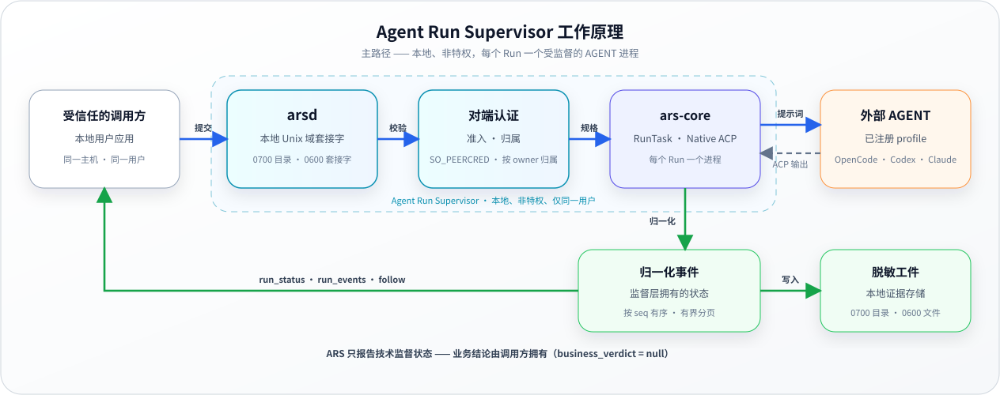

<!-- Hero -->
<p align="center">
  
</p>

<!-- Language links -->
<p align="center">
  <a href="README.md">English</a>
  &nbsp;·&nbsp;
  <b>简体中文</b>
</p>

<p align="center">
  <a href="https://github.com/jovijovi/agent-run-supervisor/actions/workflows/verify.yml">
    
  </a>
  <a href="https://codecov.io/gh/jovijovi/agent-run-supervisor">
    
  </a>
  
  <a href="LICENSE">
    
  </a>
</p>

<p align="center">
  一个小而<b>本地优先</b>的外部编码 AGENT 监督层。<br>
  一个本地守护进程，每次运行一个进程，产出<b>脱敏、可审计的本地证据</b>。
</p>

## 这是什么

凡是要驱动外部编码 AGENT 的程序，最后都会重复造同一套底层管道：拉起并照看 agent 进程、决定
agent 能碰什么、读取协议事件流、判断运行到底是怎么结束的，以及在任何东西落盘之前把敏感信息清理
干净。各写各的，结果就是每个调用方都长出一份略不安全的副本。

**Agent Run Supervisor（ARS）** 把这件事收敛成一个独立的本地层。你的应用提交一次运行 —— 用哪个
agent profile、哪个模型、哪个工作区、什么提示词 —— 剩下的交给 ARS：准入请求、只拉起一个受监督的
agent 进程、在默认拒绝（default-deny）策略下中介每一次权限请求、把 agent 的输出归一化为有序事件、
判定一个由监督层拥有的状态，并以受限权限写出脱敏工件。

你拿回来的是**可审计的证据**，而不是一团进程生命周期代码。

当你既想用程序驱动编码 agent，又想随时答得出「它想做什么、被允许做什么、最后到底怎么结束的」时，
就该用它。

## 工作原理

<p align="center">
  
</p>

主路径完全在本地：

1. **你的应用**连接 `arsd` —— 那个小而非特权的监督守护进程。
2. **`arsd` 监听一个 Unix 域套接字** —— `0700` 目录里的 `0600` 套接字。没有 TCP、没有 root、
   没有公网入口。
3. **完成对端认证与请求准入。** `arsd` 从套接字读取对端凭据并映射为 principal，再用你自己提供的
   `request_id`（同时就是幂等键）做准入。Run 与 Session 按 owner 归属：只有拥有它的调用方才能
   查询、跟随、取消或关闭。
4. **`ars-core` 执行运行。** 一个进程内 `RunTask` 独占一个受监督的 agent 进程和一条 Native ACP
   连接，由准入时就冻结下来的不可变运行规格驱动。
5. **agent 是已注册的外部进程**，从封闭 profile 启动 —— 协议上不存在任意 command/argv/环境变量透传。

返回方向上，你会通过同一个套接字拿到归一化、按 `seq` 有序的事件与一个由监督层拥有的状态，以及落
在本地磁盘上的脱敏工件。ARS 只报告**技术监督事实**，业务结论归你的应用。

设计细节见 [`docs/design/architecture.md`](docs/design/architecture.md)。

## 安装

从本仓库安装 —— 这是获得下文全部能力的受支持方式。

```bash
git clone https://github.com/jovijovi/agent-run-supervisor.git
cd agent-run-supervisor
```

运行时仅依赖 Python 标准库，因此检出后无需安装即可直接使用：

```bash
PYTHONPATH=src python3 -m agent_run_supervisor doctor
```

如果要以 editable 方式装进当前环境：

```bash
pip install -e .

# 附带测试套件与 Native ACP 套件所用的可选额外依赖
pip install -e '.[dev,native]'
```

ARS 不会隐式启动任何 agent。`doctor`、`replay`、`--print-service-unit`、`session list` 与各类
dry-run 都是只读的，不会拉起 agent 进程。

## 在本地运行 `arsd`

`arsd` 是一个 module 入口，不是控制台脚本：

```bash
# 查看选项与边界（只读）
PYTHONPATH=src python3 -m agent_run_supervisor.arsd --help

# 把 user 作用域的 systemd unit 渲染到 stdout 后退出。
# 纯文本：不检查权限、不做 reconciliation、不绑定套接字 —— 不安装、不启用、不启动任何东西。
PYTHONPATH=src python3 -m agent_run_supervisor.arsd --print-service-unit

# 启动守护进程
PYTHONPATH=src python3 -m agent_run_supervisor.arsd \
  --supervisor-root <supervisor-root> \
  --caller-mapping <UID>:<principal_id>:<owner>:<namespace>
```

守护进程模式必须提供 `--supervisor-root` 和至少一条 `--caller-mapping` —— **零条映射会拒绝监听**，
以 root 身份启动同样会被拒绝。`--socket` 默认取 `$XDG_RUNTIME_DIR/agent-run-supervisor/arsd.sock`，
否则退化为 `<supervisor-root>/arsd/arsd.sock`；`--max-concurrent-runs`、`--max-connections`、
`--log-level` 约束其余行为。

caller 映射与套接字路径属于部署侧的值，应放在权限为 `0600` 的 unit 文件里，绝不进入仓库。

守护进程重启后只对持久事实做 reconciliation：可能已派发、但没有可信终态结果的 Run 会落到
`unknown` / `quarantined` / `retryable=false`，且永不重发提示词。

## 用 Python 调用

[`ArsdClient`](src/agent_run_supervisor/arsd/client.py) 是受支持的调用方边界：显式连接、
context-managed，绝不静默重连，也绝不重放请求。每一帧都带 `api_version`（当前为 `1`）；未知版本
一律拒绝，而不是猜测。

```python
from agent_run_supervisor.arsd.client import ArsdClient

socket_path = "<XDG_RUNTIME_DIR>/agent-run-supervisor/arsd.sock"

with ArsdClient(socket_path) as client:
    client.server_info()                      # 协议/版本握手事实

    ack = client.submit(                      # 调用方自有的 request_id = 幂等键
        request_id="my-caller-request-id",
        payload={
            "request": {...},                 # 带版本的 AgentRunRequest（见下）
            "prompt_text": "用平实的语言总结这个 diff。",
            "workspace_root": "/path/to/bound/workspace",
        },
    )
    run_id = ack["run_id"]

    client.run_status(run_id)                          # accepted → progress → 唯一终态结果
    client.run_events(run_id, from_seq=0, limit=100)   # 有界、按 seq 有序的分页
    client.run_cancel(run_id)                          # 协作式取消；绝不改写终态事实

    client.session_list()                     # 按 owner 限定的 Session 清单
    client.session_status("my-session-id")
    client.session_close("my-session-id")

# 实时跟随：follow=True 返回一个 context-managed 的事件帧订阅
with ArsdClient(socket_path) as client:
    with client.run_events(run_id, from_seq=0, follow=True) as stream:
        for frame in stream:
            ...
```

`request` 是带版本的 `AgentRunRequest`：`owner` / `namespace`、`profile_id`、session 复用选择、
`requested_model` / `requested_effort`、输入引用、冻结的 `execution_grant` 引用与哈希、凭据**引用**，
以及各项 limits。

它绝不携带 shell 文本、argv、环境变量值、可执行文件路径或凭据内容 —— 这些字段在协议上根本不存在。

错误是类型化且失败关闭的。客户端异常携带稳定的错误码（例如 `PEER_UID_DENIED`、`OWNER_MISMATCH`、
`IDEMPOTENCY_CONFLICT`、`CAPACITY_EXHAUSTED`）；服务端的消息文本绝不会被回显进异常。

## Agent profile

profile 是封闭、带版本、在代码中注册的启动定义。model 与 effort 必须从活动的 agent 那里**精确**
读回 —— 能力缺失、未广告的取值或读回不精确，都会在派发任何提示词之前让该 Run 失败。

| `profile_id` | Agent | `requested_model` | `requested_effort` |
|---|---|---|---|
| `opencode-1.18.4` | OpenCode | `kimi-for-coding/k3`（默认）、`deepseek/deepseek-v4-pro` | `low` / `medium` / `high` / `max`（默认 `max`） |
| `codex-acp-1.1.7` | Codex，经其官方 ACP 适配器 | `gpt-5.6-sol` | `max` |
| `claude-agent-acp-0.61.0` | Claude，经其官方 ACP 适配器 | `claude-fable-5[1m]`、`opus[1m]`（默认） | `max` |

请逐字使用上表中的字面量：它们是 agent 自己通过 ACP 广告出来的标识，与厂商自家 CLI 接受的选择器
名称并不通用。

每个 profile 启动的都是你自己安装并钉住的 agent 运行时 —— 解释器、适配器入口与下游 CLI 都以绝对
路径**加**哈希钉住，并在派生边界上验证身份。仅有一份代码检出并不能让 agent 可启动，你仍需在本地
安装对应的 agent。

## 兼容面：`acpx` CLI 与库

仓库还提供一套免守护进程的、基于 `acpx` 的兼容面。它支持一次性 `exec` 与本地持久会话生命周期，
并写出同一类脱敏工件。当一次运行需要经过监督守护进程时，用 `arsd`：对端认证准入、调用方持有的
幂等键、按 owner 归属的运行与会话，以及守护进程级并发上限。当由单个本地进程自己驱动一个 agent、
部署里没有守护进程时，直接用这套兼容面。

```bash
agent-run-supervisor validate-role <role>.json      # 校验角色规格并打印稳定哈希
agent-run-supervisor doctor                         # 只读就绪探测，不启动 agent
agent-run-supervisor replay <events>.ndjson         # 确定性回放，不启动 agent
agent-run-supervisor run --role <role>.json --prompt-file <p>.txt --no-real-run   # 编译 + 预览
agent-run-supervisor run --role <role>.json --prompt-file <p>.txt                 # 启动一个本地 agent
agent-run-supervisor session create|send|status|close|abort|list ...              # 持久会话
agent-run-supervisor cleanup                        # 规划保留策略；--apply 才真正删除
```

未安装时从检出运行，把 `agent-run-supervisor` 换成
`PYTHONPATH=src python3 -m agent_run_supervisor`。真实的 `run` 与 `session` 轮次需要本地具备
Node、`acpx` 与目标 agent CLI。

程序化集成优先使用 [`caller.py`](src/agent_run_supervisor/caller.py) 中的通用调用方边界：

```python
from agent_run_supervisor.caller import CallerInvocationSpec, invoke_caller

result = invoke_caller(
    CallerInvocationSpec(
        mode="exec",
        role_file="reviewer.json",
        prompt="用平实的语言总结这个 diff。",
        cwd="/path/to/repo",
    )
)
print(result.supervisor_status)  # 例如 "completed"
print(result.run_dir)            # 脱敏工件目录
assert result.business_verdict is None
```

支持的模式：`exec`、`exec_dry_run`、`session_create`、`session_send`、`session_status`、
`session_close`、`session_abort`、`session_list`。

另有两个值得一提的辅助接口：
[`session_inspect`](src/agent_run_supervisor/session_inspect.py) 只读取本地工件来回答存活与健康
问题 —— 因为它不派生任何子进程，可安全用于热轮询路径；
[`hermes_caller.events`](src/agent_run_supervisor/hermes_caller/events.py) 则可在运行仍在进行时
分页读取结构化进度，且不暴露 raw agent 文本。

工件写入 `.agent-run-supervisor/runs/<run_id>/` 与 `.agent-run-supervisor/sessions/<session_id>/`。
载荷契约见 [`docs/design/result-event-schema.md`](docs/design/result-event-schema.md)。

## 保证与边界

**ARS 保证什么**

- **是监督者，不是业务裁判。** 协议或进程层面的完成永远不等于业务结论；`business_verdict`
  始终为 `null`，归调用方所有。
- **默认拒绝，由调用方冻结权限。** 调用方冻结执行授权，ARS 只执行它，绝不放宽或刷新。已注册的
  工作区内读取可以被允许；write、terminal、execute 以及未知操作一律拒绝。每次决策都产出脱敏的
  中介证据。
- **默认可审计。** 运行产出确定性的、脱敏的工件，并采用受限权限：目录 `0700`、文件 `0600`、
  最终工件原子写入。
- **不确定即失败关闭。** 无效输入、协议漂移、权限被拒、超时以及不可信的恢复，都会落到确定性的
  非成功状态，而不是猜一个结果。
- **仅本地、非特权。** `0700` 目录里的 `0600` 套接字，基于对端凭据、对照显式 caller 策略完成
  认证，且不使用 root。

**ARS 不是什么**

- **不是沙箱。** 这是协作式 agent 的策略中介，不是操作系统级隔离，不是敌对进程遏制，也不是多租户。
- **本身不构成崩溃遏制。** 生产环境依赖用户级 service manager 的 cgroup（`Restart=on-failure`、
  `KillMode=control-group`），使得杀死守护进程能连带杀死全部 agent 后代。
- **不是入口、网关或聊天集成。** 没有公网入口、没有消息投递、没有 agent 间自动路由 —— 这些属于
  调用方及其平台。

## 环境要求

| 需求 | 要求 |
|---|---|
| 运行时 | **Python ≥ 3.11**，仅标准库 —— 零第三方运行时依赖。 |
| 运行 `arsd` | Linux，且有可放置 AF_UNIX 套接字的 POSIX 用户会话，另需你提供 supervisor root 与至少一条 caller 映射。崩溃遏制还需要用户级 service manager 的 cgroup，以及带 pidfd 支持的 CPython 构建。 |
| 运行 agent | 每个 profile 启动的都是你自己安装并钉住的 agent 运行时；仅有代码检出并不提供 OpenCode、Codex 或 Claude。 |
| `acpx` 兼容运行 | 本地具备 Node、`acpx` 与目标 agent CLI —— 仅真实的 `run` 与 `session` 轮次需要。 |
| 测试（可选） | `dev` 额外依赖用于测试套件；`native` 额外依赖提供 Native ACP 与 `arsd` 套件所用的 ACP 客户端库。 |

## 开发

推荐使用 [uv](https://docs.astral.sh/uv/)；根目录 [`Makefile`](Makefile) 封装了常用命令。

```bash
make sync      # uv sync --locked --extra dev --extra release --extra native
make verify    # 完整本地关卡（与 CI 一致）
make build     # sdist/wheel + twine check
make clean     # 清理构建产物、缓存与本地临时数据
make help      # 列出全部 target
```

无 Make 时的等价命令：

```bash
uv sync --locked --extra dev --extra release --extra native
./scripts/verify_local.sh
```

`make verify` / `./scripts/verify_local.sh` 是单一本地关卡：测试、只读 CLI 冒烟、文档索引检查、
静态安全扫描与打包检查。CI 跑的就是它，说明见
[`docs/roadmap/verification.md`](docs/roadmap/verification.md)。

套件覆盖 Native ACP 核心与 `arsd` 守护进程 —— 协议分帧、对端认证与归属、准入与幂等、
reconciliation、客户端往返 —— 全部走密封的 fake agent 与临时套接字。需要真实 agent 运行时的套件
默认跳过、需显式开启，且绝不在 CI 中运行。

**pip 回退**（无 uv 时）：

```bash
pip install -e '.[dev,release,native]'
python3 -m pytest -q
```

## 许可证

© `agent-run-supervisor` 作者。以 **[MIT](https://opensource.org/license/mit)** 许可证发布
（见 [`LICENSE`](LICENSE)）。
