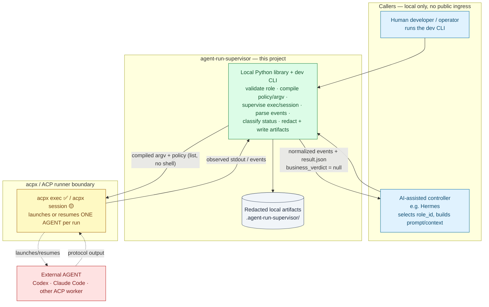
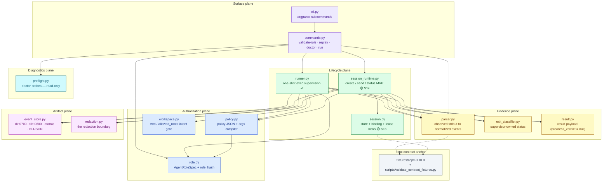
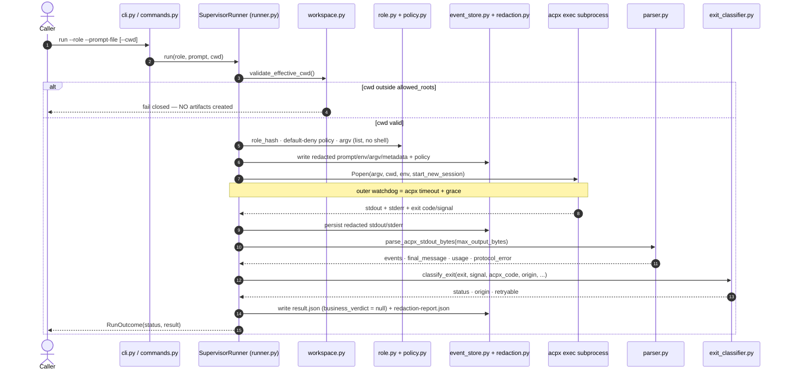
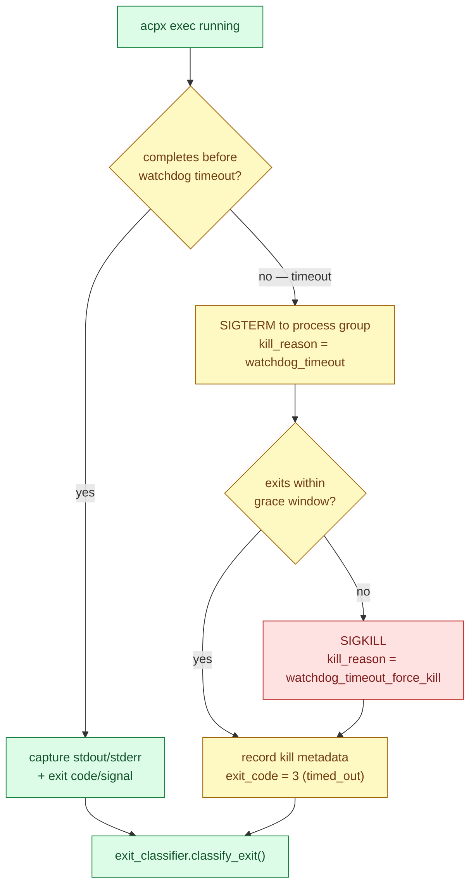
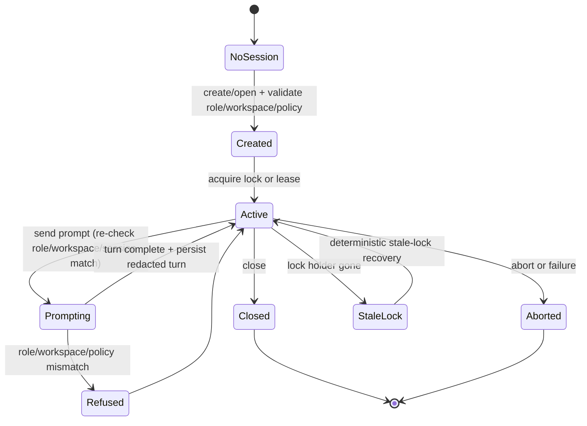
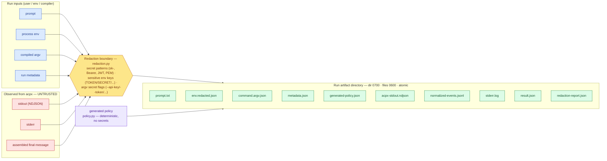
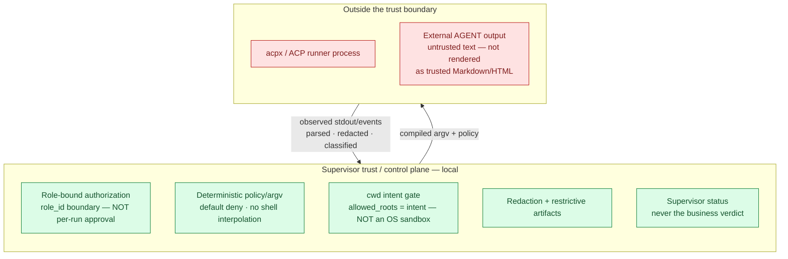

# agent-run-supervisor System Architecture

> **Authority and scope.** This document is the *system-level* architecture view for
> `agent-run-supervisor`. It is **derivative**: it visualizes and organizes what
> `GOAL.md`, `docs/product/prd.md`, `docs/roadmap/features.md`, and
> `docs/roadmap/current-status.md` already establish. It does **not** redefine product
> goals, expand scope, or grant any runtime/live approval.
>
> - For *module-level* technical detail (per-file responsibilities, data models),
>   read its companion `docs/design/technical-solution.md`.
> - For *product requirements*, read `docs/product/prd.md`.
> - For *phase/closure status and acceptance*, read `docs/roadmap/current-status.md`
>   and `docs/roadmap/features.md`. Where this document marks something "implemented",
>   it means the code path exists; **phase acceptance/closure remains roadmap-owned.**

---

## 0. How to read this document

This document is intentionally "图文并茂" — it shows the system at multiple zoom
levels (context → containers/components → lifecycles → boundaries) with diagrams,
then maps every architectural element back to concrete files and evidence gates.

### 0.1 Implementation-status markers

These markers describe **code reality**, not phase bookkeeping:

| Marker | Meaning |
|---|---|
| ✅ | Implemented as a real code path in this repository. |
| 🟡 | Partially implemented; exec-shaped surfaces exist, session/long-lived tails remain. |
| 🟦 | **Planned and product-required** (not a non-goal); not yet implemented. |

> The product is **two execution modes**: one-shot exec **and** persistent sessions.
> This document never reduces the product to "exec-only". Persistent sessions are a
> scheduled future phase (`S1`), **not** a non-goal.

### 0.2 Diagram color legend

| Color group | Used for |
|---|---|
| 🟦 Blue | Callers / authorization plane (role, policy, workspace) |
| 🟩 Green | The supervisor and its trusted/control plane |
| 🟨 Yellow | The acpx / ACP runner boundary and evidence plane |
| 🟥 Red | Outside the trust boundary (acpx process, external AGENT, observed untrusted output) |
| ⬜ Grey/Purple | Artifacts, contract anchor, diagnostics |

---

## 1. Product boundary and system context (Level 0)

`agent-run-supervisor` sits as a thin, **local** supervisor between a caller (a human
operator at a dev CLI, or an AI-assisted controller such as Hermes) and the
**acpx / ACP runner boundary** that actually launches an external AGENT. The supervisor
owns *runner/session lifecycle and evidence*. It does **not** own product meaning, IM
delivery, Gateway lifecycle, public routing, or any agent-to-agent fan-out.



### 1.1 Responsibility split

| Zone | Owns | Explicitly does **not** own |
|---|---|---|
| **Caller project / controller** | Product/business intent, final verdict interpretation, progress rendering, delivery, platform integration. | Runner lifecycle, policy compilation, stream parsing, redaction. |
| **agent-run-supervisor** | `AgentRoleSpec` authorization, acpx policy/argv compilation, run/session lifecycle, event parsing, status classification, redacted artifacts. | Business PASS/BLOCK, IM/Gateway/Sachima behavior, public ingress, agent-to-agent routing. |
| **acpx / ACP boundary** | Launching/resuming the external AGENT under the compiled policy. | Deciding business outcome; supervising itself. |
| **External AGENT** | Doing the requested work and emitting protocol output (treated as **untrusted**). | Anything inside the supervisor trust plane. |

> **Boundary invariants** (from PRD §3, §6): no public ingress; no real IM delivery;
> no Gateway restart/reload/replace; no production config writes; no live/default-on
> behavior; no `@all`; no agent-to-agent auto-routing. A run is always an explicit,
> caller-initiated, single-AGENT invocation.

---

## 2. Container and component architecture (Level 1)

Internally the library is organized into **planes**, each a cohesive responsibility band.
The runner orchestrates the authorization, evidence, and artifact planes; the surface
plane (CLI) is the entry point; diagnostics stay strictly read-only.



### 2.1 Plane responsibilities

- **Surface plane** (`cli.py`, `commands.py`) — the only entry points. `run` reaches the
  exec runner; `--no-real-run` produces dry-run compile/preview artifacts; `doctor` and
  `replay` never launch an AGENT.
- **Authorization plane** (`role.py`, `policy.py`, `workspace.py`) — `AgentRoleSpec` is the
  durable authorization boundary; the policy compiler turns role permissions into a
  default-deny acpx policy and a shell-free argv list; the workspace gate validates the
  effective cwd against `allowed_roots` (intent only — **not** an OS sandbox).
- **Lifecycle plane** — `runner.py` supervises a real one-shot `acpx exec` subprocess ✅;
  `session.py` provides the S1b persistent-session store, binding, and lease-lock
  foundation 🟡; `session_runtime.py` adds the S1c create/send/status runtime MVP plus the
  S1d close/abort/list lifecycle slice 🟡 that drives fixture-shaped acpx session commands
  over that foundation. Multi-turn resume, crash/interruption recovery, real-acpx smoke, and
  retention/cleanup remain later S1 slices (see §4).
- **Evidence plane** (`parser.py`, `exit_classifier.py`, `result.py`) — converts observed
  acpx output into normalized events, a supervisor-owned status, and a stable result
  payload whose `business_verdict` is always `null`.
- **Artifact plane** (`event_store.py`, `redaction.py`) — restrictive-permission, atomic,
  redacted local artifacts (see §5).
- **Diagnostics plane** (`preflight.py`) — read-only environment/fixture probes for `doctor`.
- **Contract anchor** (`fixtures/acpx-0.10.0` + validator) — the parser only consumes
  fixture-proven acpx schemas; new shapes require fresh fixtures before code trusts them.

---

## 3. One-shot exec run lifecycle (Level 2) — ✅ implemented (E1)

The exec runner is **fail-closed**: invalid role, cwd-outside-roots, malformed stdout,
permission denial, protocol drift, and watchdog timeout all resolve to deterministic
non-success statuses, and an invalid cwd creates **no** artifacts at all.



### 3.1 Watchdog and kill path

The runner runs an **outer** watchdog set longer than the acpx timeout. On expiry it
terminates the process group (where supported), waits a grace window, then force-kills,
recording kill metadata on the result.



### 3.2 Status classification

`exit_classifier.py` maps observed runner/session behavior to **supervisor-owned** statuses.
The base exit-code map is then refined using acpx metadata and supervisor kill signals.
Supervisor status is **never** the caller's business verdict.

| acpx exit code | Base supervisor status |
|---:|---|
| `0` | `completed` |
| `1` | `runner_error` (refined by `acpxCode`/origin → `invalid_invocation`, `timed_out`, `no_session`, `permission_denied`, `infrastructure_error`) |
| `2` | `invalid_invocation` |
| `3` | `timed_out` |
| `4` | `no_session` |
| `5` | `permission_denied` |
| `130` | `interrupted` |
| other / unknown | `infrastructure_error` |

Refinements that keep the model honest:

- **exit `0` but `protocol_error` in stdout → `protocol_error`** (a clean exit code never
  launders a malformed stream into success).
- **supervisor watchdog/kill engaged → `timed_out`** (on timeout) or `infrastructure_error`,
  with `origin = supervisor`.
- nonzero exits never become `completed`.

Full status set: `completed`, `runner_error`, `invalid_invocation`, `timed_out`,
`no_session`, `permission_denied`, `interrupted`, `protocol_error`,
`infrastructure_error`, `policy_error`.

---

## 4. Persistent session lifecycle and control points (Level 2) — 🟡 partial (S1b foundation + S1c create/send/status MVP)

> **Status banner.** Persistent ACP/acpx sessions are a **first-class product requirement**
> (PRD FR-5) scheduled as phase **S1**, **after** the exec runner. S1a captured the
> `acpx@0.10.0` command/schema contract, S1b implements the local session store, binding,
> and lease-lock foundation, and S1c adds the create/send/status runtime MVP
> (`session_runtime.py`) that compiles fixture-shaped acpx session commands, persists
> redacted turn + management artifacts, and re-validates the binding under a lease on every
> mutation. S1d adds the close/abort/list lifecycle slice — fixture-proven `sessions close`
> and `cancel -s`, an atomic `closed` state transition, closed-session refusal, and a local
> read-only `list`. The remaining persistent-session runtime — multi-turn resume, full
> crash/interruption recovery, real-acpx smoke, and retention/cleanup — stays open; S1 is
> **not** complete. Persistent sessions are **not** a non-goal.



### 4.1 Control points (the "must hold" gates for S1)

1. **Identity re-validation** — re-check role hash, workspace hash, acpx version, and
   policy hash on create/open and on every send; refuse on mismatch (no silent reuse).
2. **Concurrency safety** — session locks/leases prevent concurrent unsafe mutation.
3. **Stale-lock recovery** — detect and recover from stale locks deterministically;
   handle crash/interruption.
4. **No leakage** — refuse cross-role, cross-workspace, or stale-policy reuse so context
   cannot leak between roles or workspaces.
5. **Explicit close/abort** — defined close/abort semantics with their own statuses and
   artifact evidence.

S1b implements the first three local control surfaces for store-level state:
role/workspace/policy/acpx binding, lease locking, and expired-lease replacement. S1c
exercises control points 1, 2, and 4 against fixture-shaped acpx commands: `create_session`
validates the role/workspace and binds the record, `send` re-opens the record, re-validates
the binding, takes a lease, runs a single `prompt -s` turn, and releases the lease on
success **and** failure, and `status` re-validates the binding for a read-only `status -s`
query. S1d adds control point 5 (`close/abort`): `close` and `abort` re-check open state under
a local lifecycle guard; `close` also runs the fixture-proven `sessions close` under the session
lease and atomically marks the record `closed`; `send` re-checks closed state under the acquired
lease before launching a turn so a completed close cannot race into a stale prompt; `abort` runs
`cancel -s` and reports an honest `cancelled` flag without a business verdict. All mutating
session operations refuse a closed session before subprocess/artifact mutation. A
local read-only `list_sessions` enumerates store records without launching acpx. Full
crash/interruption stale-lock recovery (control point 3 beyond expired-lease replacement),
multi-turn resume, and real-acpx smoke remain **not** yet implemented.

S1 must extend, **not** replace, the role-bound authorization model — sessions bind to
the same `role_id` boundary as exec runs, never to per-run human approval tickets. S1
introduces **no** public ingress, real delivery, Gateway lifecycle, or agent-to-agent
routing.

---

## 5. Artifact and data-flow model + redaction boundary

Every value that originates from the **user**, the **environment**, or the **untrusted
acpx/AGENT stream** crosses the **redaction boundary** (`redaction.py`) before it is
written. The deterministic compiler output (`generated-policy.json`) carries no secrets
and is written directly.



### 5.1 Redaction boundary behavior

- **Text** (`prompt`, `stderr`, `stdout`, `final_message`) is scrubbed of OpenAI-style
  keys, `Authorization: Bearer` headers, JWTs, and PEM private-key headers.
- **Env** drops values whose key contains `TOKEN`, `SECRET`, `PASSWORD`, `API_KEY`,
  `PRIVATE_KEY`, `CREDENTIAL`, `OPENAI`, `ANTHROPIC`, etc., and pattern-scrubs the rest.
- **Argv** redacts the value following `--api-key`, `--token`, `--password`.
- Every redaction is recorded in `redaction-report.json` (pattern name + location only —
  never the secret value).
- Observed output is treated as **untrusted text**. The supervisor records it as
  redacted evidence; it does **not** render it as trusted Markdown/HTML.

### 5.2 Artifact layout

```text
# Current — one-shot exec run (✅ implemented)
.agent-run-supervisor/runs/<run_id>/
  metadata.json
  prompt.txt
  env.redacted.json
  command.argv.json
  generated-policy.json
  acpx-stdout.ndjson
  normalized-events.jsonl
  stderr.log
  result.json
  redaction-report.json

# Current — persistent session foundation (🟡 S1b) + create/send/status (🟡 S1c) + close/abort/list (🟡 S1d)
.agent-run-supervisor/sessions/<session_id>/
  session.json                 # S1b store record; S1d flips state -> "closed" atomically
  lock.json                    # S1b — only while a lease is held
  management/                  # S1c/S1d — redacted management-command summaries
    create.json
    status.json
    close.json                 # S1d — redacted `sessions close` evidence
    abort.json                 # S1d — redacted `cancel -s` evidence
  turns/<turn_id>/             # S1c — one redacted directory per send turn
    prompt.txt
    acpx-stdout.ndjson
    normalized-events.jsonl
    stderr.log
    result.json                # business_verdict = null
    redaction-report.json

# Future — remaining persistent session runtime (remaining S1/H1)
.agent-run-supervisor/sessions/<session_id>/
  role.snapshot.json           # runtime snapshots, if needed
  workspace.snapshot.json
  generated-policy.json
  # plus multi-turn resume artifacts and retention/cleanup
```

Determinism/auditability properties: directories are `0700`, files `0600`, final
artifacts are written atomically (temp file + `os.replace`), streams are append-only
NDJSON, and fixture replay is deterministic.

---

## 6. Trust and security boundaries + explicit non-approvals

The **trust boundary** runs between the supervisor's local control plane and everything
the acpx runner / external AGENT produces. Inputs are compiled deterministically and
shipped without a shell; outputs are parsed, redacted, and classified before the
supervisor trusts them as *evidence* (never as a *verdict*).



### 6.1 Honest security claims (what the architecture **does** enforce)

- Role validation and a stable role hash; unknown/unsafe claims fail closed
  (e.g. `allowed_roots_security_boundary: true` is rejected).
- Default-deny acpx policy; non-interactive permission failure; argv as a list, never a
  shell string.
- cwd/workspace **intent** validation before any artifact is created.
- Redaction by default; restrictive artifact permissions; atomic final writes.
- Outer watchdog with grace + force-kill and recorded kill metadata for exec.

### 6.2 What the architecture does **not** claim or do

These are repository-wide non-approvals (PRD §6, `current-status.md` §5). No diagram or
prose here may be read as introducing any of them:

| Not approved / not claimed | Honest statement |
|---|---|
| OS/filesystem sandbox via `allowed_roots` | It is cwd/config **intent** validation only. |
| Per-run human approval as default authz | Authorization is **role-bound** to `role_id`. |
| Business PASS/BLOCK | Supervisor status ≠ caller business verdict (`business_verdict = null`). |
| Public ingress · real IM delivery · Gateway lifecycle | Out of scope; caller/platform territory. |
| Production config writes · live/default-on | Runs are explicit and local-first. |
| `@all` · agent-to-agent auto-routing | One explicit AGENT per invocation; no fan-out/routing. |
| Trusted Markdown/HTML rendering of output | Output is recorded as redacted, untrusted text. |
| Sachima behavior / real AGENT auto-replies | Not integrated; thin caller integration is a parked future phase. |

---

## 7. Architecture-to-module mapping

| Architectural element | File(s) | Feature ID | Impl. status | Evidence |
|---|---|---|---|---|
| CLI surface | `src/agent_run_supervisor/cli.py` | F-CLI-001/002/003 | ✅ / 🟡 | `tests/test_cli_smoke.py` |
| Command handlers | `src/agent_run_supervisor/commands.py` | F-CLI-*, F-RUN-001, F-EXEC-001 | ✅ / 🟡 | `tests/test_cli_commands.py` |
| Role model + hash | `src/agent_run_supervisor/role.py` | F-ROLE-001 | ✅ / 🟡 session config | `tests/test_role.py` |
| Policy + argv compiler | `src/agent_run_supervisor/policy.py` | F-POLICY-001 | 🟡 (exec ✅, S1c create/ensure/show/status/prompt compilers ✅, S1d close/cancel compilers ✅) | `tests/test_policy.py`, `tests/test_session_strategy_guard.py` |
| cwd / allowed-roots gate | `src/agent_run_supervisor/workspace.py` | F-WORKSPACE-001 | 🟡 | `tests/test_workspace_gate.py` |
| One-shot exec supervision | `src/agent_run_supervisor/runner.py` | F-EXEC-001 (E1) | ✅ (phase closure roadmap-owned) | `tests/test_runner_exec.py`, `tests/test_runner_dry_run.py` |
| Persistent session store | `src/agent_run_supervisor/session.py` | F-SESSION-001 (S1) | 🟡 S1b foundation | `tests/test_session_store.py`, `tests/test_session_strategy_guard.py` |
| Persistent session runtime | `src/agent_run_supervisor/session_runtime.py` | F-SESSION-001 (S1) | 🟡 S1c create/send/status MVP (close/abort/list/crash recovery/retention open) | `tests/test_session_runtime.py` |
| Observed event parser | `src/agent_run_supervisor/parser.py` | F-PARSER-001 | 🟡 (S1c adds prompt-turn NDJSON + `summarize_management_json` management summarizer) | `tests/test_parser.py` |
| Status classifier | `src/agent_run_supervisor/exit_classifier.py` | F-STATUS-001 | 🟡 | `tests/test_exit_classifier.py` |
| Result payload | `src/agent_run_supervisor/result.py` | F-STATUS-001 / F-EXEC-001 | ✅ | covered via runner/classifier tests |
| EventStore + redaction | `src/agent_run_supervisor/event_store.py`, `redaction.py` | F-STORE-001 | 🟡 | `tests/test_event_store.py`, `tests/test_redaction.py` |
| Doctor probes | `src/agent_run_supervisor/preflight.py` | F-CLI-003 (H1 tail) | 🟡 | `tests/test_preflight.py` |
| acpx contract anchor | `fixtures/acpx-0.10.0`, `scripts/validate_contract_fixtures.py` | C0 | ✅ | `tests/test_validate_contract_fixtures.py` |

> Impl. status reflects code reality; phase acceptance/closure (e.g. E1, S1) is owned by
> `docs/roadmap/current-status.md` and `docs/roadmap/features.md`.

---

## 8. Test and evidence gates that keep the architecture honest

The architecture's invariants are not aspirational — each is held by a concrete gate.
Run the gates from the repository root.

| Gate | Command | Architectural invariant it protects |
|---|---|---|
| Contract fixtures | `python3 scripts/validate_contract_fixtures.py fixtures/acpx-0.10.0` | The parser only trusts the proven acpx `0.10.0` contract; drift fails closed. |
| Unit/integration tests | `python3 -m pytest -q` | Role/policy/workspace/parser/classifier/store/redaction + fake-subprocess & watchdog behavior. |
| Syntax/import smoke | `python3 -m compileall -q src scripts tests` | All modules import cleanly. |
| Doctor (read-only) | `PYTHONPATH=src python3 -m agent_run_supervisor doctor` | Diagnostics never launch an AGENT (`launched_real_agent = false`). |
| Replay determinism | `PYTHONPATH=src python3 -m agent_run_supervisor replay fixtures/acpx-0.10.0/success-codex-sentinel/stdout.ndjson` | Fixture replay is deterministic and parser-stable. |
| Docs index | `python tools/build_docs_index.py --check` | `docs/INDEX.md` matches frontmatter; this doc is registered. |
| Drift signal | `python tools/docs_drift_signal.py --check` | Lesson/practice drift report is current. |
| Whitespace/diff | `git diff --check` | No accidental whitespace/conflict-marker damage. |
| Secret/static scans | secret-shaped + dangerous-pattern scans over added lines (CI / pre-PR) | No secrets or unsafe subprocess/network/config-write patterns leak. |

CI gate `Verify` plus these local gates are the acceptance surface for any change that
touches the architecture.

### 8.1 Open architectural tails (roadmap-owned)

These are tracked in `docs/roadmap/current-status.md` §4 and are **not** re-decided here:

- `ARS-SESSIONS` — persistent session support (S1): S1a contract evidence, S1b store/lock foundation, the S1c create/send/status runtime MVP, and the S1d local `close`/`abort`/`list` lifecycle (with closed-session refusal) exist; real-acpx smoke, multi-turn resume, crash/interruption recovery, and retention/cleanup remain open.
- `ARS-DOCTOR-COMPLETE` — adapter/npx/policy/cwd/redaction/session doctor probes (H1).
- `ARS-RETENTION-CLEANUP` — run/session artifact retention/cleanup knobs (H1).
- `ARS-SANDBOX-BOUNDARY` — parked; any real OS sandbox is a separate phase.
- `ARS-CALLER-INTEGRATION` — parked; thin caller integration needs separate approval.

---

## 9. Cross-references

- Product positioning: `GOAL.md`
- Product requirements: `docs/product/prd.md`
- Module-level technical detail: `docs/design/technical-solution.md`
- Feature completion: `docs/roadmap/features.md`
- Roadmap, phases, acceptance, non-approvals: `docs/roadmap/current-status.md`
- Development flow and gates: `docs/AI_FLOW.md`
- Generated documentation index: `docs/INDEX.md`
