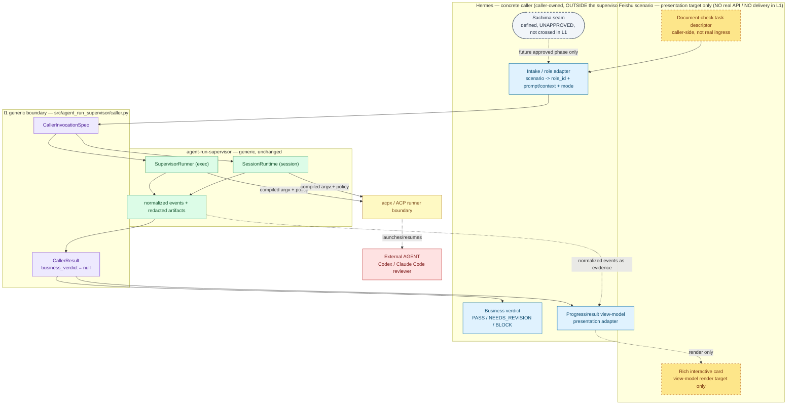
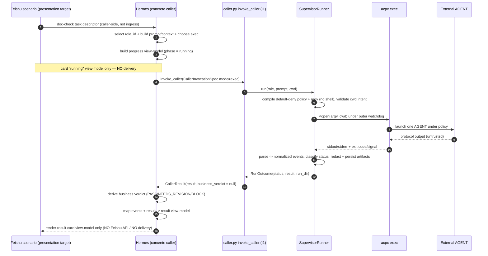
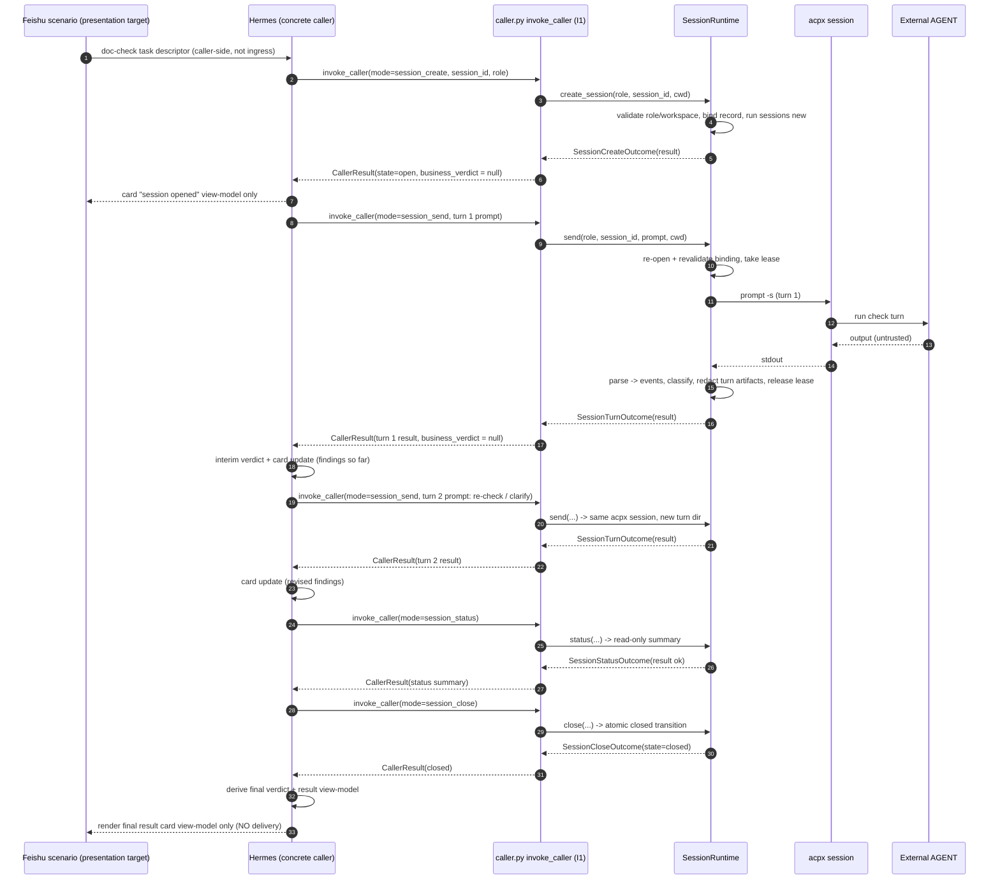
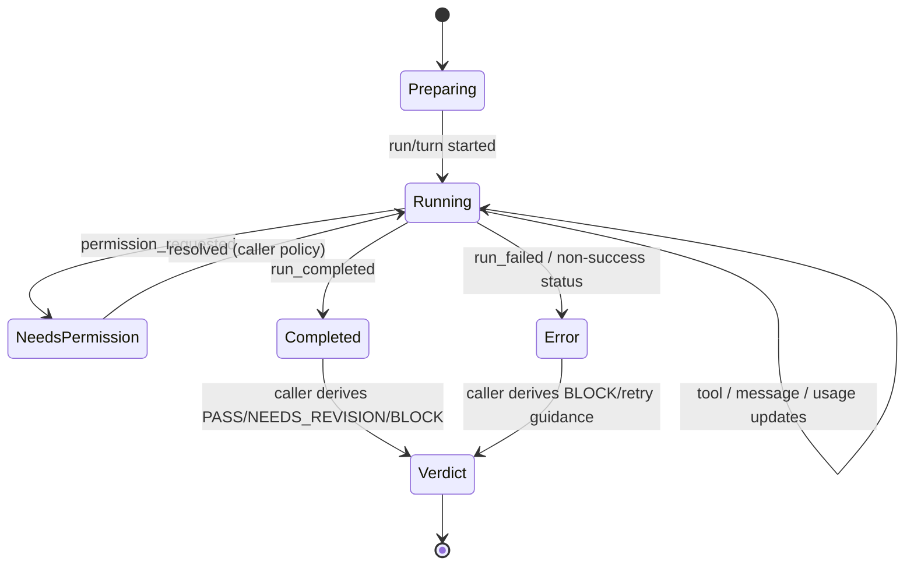

> **Archived plan（冷区）：** 非 active 上下文。Roadmap 章节迁移见
> [`docs/roadmap/MIGRATION.md`](../roadmap/MIGRATION.md)。
> 验收摘要见对应 [`docs/roadmap/archive/phases/`](../roadmap/archive/phases/) 条目。

# L1 Concrete Caller Integration Design

> **Scope banner — design-only.** This is the **L1 design document** for a *concrete*
> caller built on the generic I1 boundary (`src/agent_run_supervisor/caller.py`). It
> **implements no runtime code** and grants **no** new live/runtime approval. The named
> concrete caller is **Hermes**, the local AI-assisted controller. The **Feishu
> document-check** task is a **scenario / presentation target only**: there is **no** real
> Feishu API, **no** IM delivery, **no** platform ingress, and **no** Gateway/Sachima live
> behavior anywhere in this design. All standing non-approvals
> (`docs/roadmap/non-approvals.md`) remain in force. Connecting Hermes to Sachima for
> real debugging/testing is a **separate, later, explicitly-approved phase**; L1 defines the
> seam but does not cross it.

## 1. Goal

Describe, at design level only, how a **concrete local caller (Hermes)** drives
`agent-run-supervisor` through the existing generic I1 caller boundary for a realistic
**document-check** scenario, in **both** `exec` and `persistent session` modes, so that a
later implementation phase can build the Hermes caller and its Feishu-card view-model
*without* changing the supervisor's generic contract, moving the business verdict into the
supervisor, or introducing any platform/live behavior.

Concretely, L1 fixes:

- the **layering** between the Feishu scenario, the Hermes caller, the generic I1 boundary,
  and the supervisor;
- the **exec** and **persistent-session** caller flows for document-check;
- the **input contract** Hermes uses (`CallerInvocationSpec`) and the **output contract** it
  consumes (`CallerResult` / `result.json` projections), unchanged from I1;
- a **normalized-event → progress/result view-model** mapping that is **caller-owned**;
- an **ownership matrix** that keeps the supervisor generic and the verdict/rendering with
  the caller;
- the **Sachima future seam** as a defined-but-unapproved interface.

## 2. Source-of-truth trace

Read in authority order; this design is **derivative** of all of them.

- Product positioning: `GOAL.md` ("what this project owns" vs "what caller projects own").
- Product requirements: `docs/product/prd.md` — §2 (Hermes named as a primary
  AI-assisted caller), §3 (supervisor-not-business-judge; no hidden live expansion),
  FR-4 (exec), FR-5 (persistent sessions), FR-6 (normalized events), FR-7 (status ≠
  verdict), FR-9 (FR-9 generic local caller boundary / I1), §6 (non-goals).
- System architecture: `docs/design/architecture.md` — §1/§1.1 (caller vs supervisor
  responsibility split; "AI-assisted controller e.g. Hermes"), §3 (exec lifecycle), §4
  (session lifecycle), §6.2 (non-approvals, incl. "trusted Markdown/HTML rendering" and
  "Sachima behavior"), §8.1 (`ARS-CALLER-INTEGRATION` tail).
- Technical solution: `docs/design/technical-solution.md` — §3.10 (`caller.py`
  responsibilities), §8 (thin integration boundary).
- Caller-stable schema: `docs/design/result-event-schema.md` — §2.5 (`CallerResult.to_dict`),
  §3 (statuses/error codes), §4 (normalized event families), §8 (caller-stability /
  `business_verdict` always `null`).
- Feature tracker: `docs/roadmap/features.md` — `F-INTEGRATION-001` (I1, Done),
  `F-SESSION-001`, `F-NONGOAL-001`.
- Roadmap/status: `docs/roadmap/current-status.md` — §3 (I1), §4 (`ARS-CALLER-INTEGRATION`),
  §5 (non-approvals).
- Workflow & plan rules: `docs/AI_FLOW.md`, `docs/plans/README.md`.
- I1 boundary plan: `docs/plans/archive/2026-06-01-i1-local-caller-thin-integration.md`.

## 3. Scope

In scope (design artifacts only):

- A **caller-side layering** that places Hermes and a Feishu-card view-model **above** the
  generic I1 boundary, with the supervisor unchanged and generic.
- **Concrete caller (Hermes)** responsibilities and the exact I1 surface it uses.
- A **document-check scenario** expressed end-to-end in both modes.
- **Exec flow** and **persistent-session flow** designs with sequence diagrams.
- **Input contract** (how Hermes populates `CallerInvocationSpec`) and **output contract**
  (how Hermes consumes `CallerResult`), reusing the I1/schema contracts verbatim.
- A **normalized-event → progress/result view-model mapping** owned by the caller.
- An **ownership matrix**.
- A **Sachima future seam** definition (interface only).
- A **verification plan**, **rollback**, and **PR/review process** for this design doc.

Explicitly **out of scope** for L1 (and unchanged from current non-approvals):

- Any runtime code, tests, CLI commands, config, or changes to `caller.py` /
  `SupervisorRunner` / `SessionRuntime` / parser internals.
- Real Feishu API calls, card delivery, message posting, or any IM delivery.
- Platform ingress / webhook receipt / public endpoints.
- Sachima behavior integration, Gateway lifecycle, automatic replies, live/default-on
  behavior, `@all`, agent-to-agent auto-routing, worker auto-routing.
- Adding any platform identifier (channel/card/message/webhook/recipient/Gateway/delivery
  state) to `CallerResult` or the generic supervisor API.
- Moving the business verdict into the supervisor.
- Trusted Markdown/HTML rendering of agent output.
- Live event streaming/push from the supervisor to the caller (current supervisor emits
  normalized events as **persisted per-run/per-turn evidence**, not a live subscription;
  caller-owned presentation mapping is covered in §12).

## 4. Non-goals / non-approvals

L1 inherits **every** non-approval in `docs/roadmap/non-approvals.md` and PRD §6
verbatim and adds nothing live. In particular, authoring this design does **not** approve or
imply:

- Sachima behavior integration or real AGENT automatic replies;
- public ingress, real IM delivery, or any Feishu API/card delivery;
- Gateway restart/reload/replace or production config writes;
- live/default-on behavior, `@all` fanout, worker/agent-to-agent auto-routing;
- participant persistence or management UI;
- trusted Markdown/HTML rendering of untrusted agent output;
- treating `allowed_roots` as an OS/filesystem sandbox;
- per-run human approval as the default authorization model (authorization stays
  role-bound to `role_id`).

The Feishu document-check task is **scenario/presentation only**. Sachima connectivity is a
**separate later approved phase** (§14).

## 5. The named concrete caller: Hermes

Hermes is the **local AI-assisted controller** already named as a primary caller in PRD §2
and architecture.md §1. As the *concrete* caller, Hermes lives **entirely caller-side**,
**outside** `agent-run-supervisor`, and consumes only the generic I1 boundary. Hermes owns:

1. **Task intake (scenario-side).** Accepts a document-check *task descriptor* originating
   from the Feishu scenario. In L1 this is a caller-side, in-process descriptor — **not** a
   real webhook/ingress and **not** a supervisor input.
2. **Role selection.** Chooses an `AgentRoleSpec` / `role_id` for document review (e.g. a
   read-oriented `doc-check-reviewer` role). Role validation/authorization remains
   supervisor-owned (PRD FR-1).
3. **Prompt/context assembly.** Builds caller-owned `prompt` + `context` text (the check
   instructions and the document material/reference). The supervisor may concatenate these
   but never interprets business success (I1 rule).
4. **Mode choice.** Picks `exec` for a bounded single-pass check, or the
   `session_create`/`session_send`/`session_status`/`session_close` lifecycle for an
   interactive multi-turn review.
5. **Invocation.** Calls `invoke_caller(CallerInvocationSpec(...))` and receives a
   `CallerResult`. Hermes never parses raw ACP/acpx streams.
6. **Business verdict.** Derives the document-check verdict (e.g. `PASS` /
   `NEEDS_REVISION` / `BLOCK`) from `CallerResult` — this is **caller-owned** and lives
   nowhere in the supervisor (`business_verdict` stays `null`).
7. **View-model + presentation.** Maps normalized events + result into a **progress/result
   view-model** that a Feishu rich interactive card *would* render. The view-model and the
   card adapter are **caller-owned presentation**; L1 stops at view-model construction with
   **no delivery**.

Hermes is therefore two caller-side adapters around the generic boundary: an **intake/role
adapter** (scenario → `CallerInvocationSpec`) and a **presentation adapter**
(`CallerResult` + events → view-model). Both are out of the supervisor.

## 6. Feishu document-check scenario

A realistic, redacted walk-through (all identifiers are `[REDACTED]`; none are real or
committed):

> A user in a Feishu space starts a **document-check** task: *"Check design doc
> `[REDACTED_DOC_REF]` for completeness and broken cross-references."* The Feishu side will
> render progress and the final findings using a **rich interactive card**.

L1 models this as:

1. **Scenario task descriptor (caller-side, illustrative — not real ingress):**
   ```text
   doc_check_task = {
     task_id:        "[REDACTED]",          # caller-side correlation only; never a supervisor field
     document_ref:   "[REDACTED_DOC_REF]",  # path/handle the caller resolves to local content
     check_profile:  "completeness+xref",   # caller business config
     requested_by:   "[REDACTED]",          # caller-side identity; never sent to supervisor
     surface:        "feishu_card"          # presentation target hint, caller-owned
   }
   ```
   This descriptor is **caller-owned**. Its fields are **not** passed as platform fields to
   the supervisor; Hermes uses them only to choose a role and assemble prompt/context.
2. **Hermes → role + prompt/context.** Hermes picks the `doc-check-reviewer` role, resolves
   `document_ref` to local document content/path, and builds caller-owned `prompt`
   (the check instructions) and `context` (the document material or a local reference).
3. **Hermes → supervisor.** Hermes invokes the generic boundary (exec or session — §7/§8).
4. **Progress view-model.** Hermes maps normalized events / per-turn results into a progress
   view-model the Feishu card *would* show (§12).
5. **Result + verdict.** On completion Hermes reads `CallerResult.result`
   (`status`, `final_message`, artifacts), **derives its own verdict**, and builds the
   result view-model.
6. **No delivery.** L1 ends at the constructed view-model. No card is posted; no Feishu API
   is called.

### 6.1 Layered context (design diagram)



## 7. Exec flow (one-shot document-check)

Use `exec` for a bounded, single-pass document check (no follow-up turns needed).

- Hermes builds `CallerInvocationSpec(mode="exec", role=<doc-check-reviewer>, prompt=<check
  instructions>, context=<document material/ref>, cwd=<docs repo>, runs_dir=<local>)`.
- `invoke_caller` delegates to `SupervisorRunner.run(...)`; the supervisor compiles a
  default-deny policy + argv (no shell), validates cwd intent, launches one `acpx exec`
  under the watchdog, parses observed stdout into normalized events, classifies a
  supervisor status, and persists redacted run artifacts.
- `invoke_caller` returns a `CallerResult` wrapping the run `result.json`
  (`business_verdict: null`).
- Hermes derives the document-check verdict from `status` + `final_message` + evidence, then
  builds a **two-phase** card view-model: a *running* phase (spinner) before completion and a
  *result* phase after (findings + verdict). In exec mode the normalized events are read
  from the completed run's evidence (post-hoc), so progress is coarse (running → done); use
  the session flow (§8) for turn-by-turn progress.

A dry-run variant (`mode="exec_dry_run"` → `SupervisorRunner.dry_run`) lets Hermes preview
the compiled policy/argv with no AGENT launch — useful for caller-side validation and for
rendering a "configuration preview" card without running anything.

### 7.1 Exec sequence diagram



## 8. Persistent-session flow (interactive multi-turn document-check)

Use a persistent session when the Feishu user iterates: an initial full check, then a
re-check after revision or a follow-up question. The generic I1 boundary exposes
`session_create`, `session_send`, `session_status`, and `session_close` (abort/list remain
lower-level `SessionRuntime` features not surfaced by I1's caller boundary — see I1 plan §8).

Flow:

1. `session_create` — Hermes opens a local session bound to the role/workspace/policy/acpx
   identity; the card shows "session opened / preparing".
2. `session_send` (turn 1) — full document check; the supervisor takes a lease, runs one
   `prompt -s` turn, persists a redacted turn `result.json`, and releases the lease. Hermes
   updates the card with interim findings.
3. `session_send` (turn 2) — re-check after revision, or answer a clarifying question
   ("which references are broken?"); continuity is preserved on the same acpx session.
4. `session_status` — read-only liveness/summary; the card reflects "checking / alive".
5. `session_close` — atomic local `closed` transition; the card switches to the final
   result + verdict.

Each turn/management call returns its own `CallerResult`, giving Hermes a natural per-turn
boundary to update the card view-model. Binding revalidation, lease handling,
closed-session refusal, and redaction stay **supervisor-owned**.

### 8.1 Persistent-session sequence diagram



## 9. Input contract (Hermes → supervisor)

L1 reuses the **I1 generic** `CallerInvocationSpec` verbatim and adds **no** fields. Hermes
populates it as follows (see `src/agent_run_supervisor/caller.py` and
`docs/design/result-event-schema.md` §2.5):

| `CallerInvocationSpec` field | Type | Hermes (doc-check) usage |
|---|---|---|
| `mode` | `str` | `exec` / `exec_dry_run` / `session_create` / `session_send` / `session_status` / `session_close`. |
| `role` *or* `role_file` | `AgentRoleSpec` \| path | Exactly one. The `doc-check-reviewer` role (read-oriented permissions). |
| `prompt` | `str` \| None | Caller-owned check instructions. Required for `exec`, `exec_dry_run`, `session_send`. |
| `context` | `str` \| None | Caller-owned document material/reference; concatenated with `prompt` by the helper, never interpreted. |
| `cwd` | `str` \| None | Local docs/repo dir; validated against role `allowed_roots` (intent only). |
| `runs_dir` | path \| None | Local exec artifact root. |
| `sessions_dir` | path \| None | Local session artifact root. |
| `session_id` | `str` \| None | Required for all session modes; caller-chosen local id. |
| `session_name` | `str` \| None | Optional; accepted only for `session_create`. |

### 9.1 Caller-side input that stays *out* of the spec

The Feishu task descriptor fields (`task_id`, `document_ref`, `requested_by`, `surface`,
…) are **caller-owned correlation/business inputs**. They are **never** added to
`CallerInvocationSpec` or forwarded to the supervisor as platform fields. Hermes resolves
them locally into `role` + `prompt`/`context` + `mode`. Any sensitive identifier is
`[REDACTED]` in examples and kept in local caller state, not in supervisor artifacts.

### 9.2 Illustrative `doc-check-reviewer` role (design sketch, not committed config)

```text
role_id:        doc-check-reviewer            # stable authorization boundary
display_name:   "[REDACTED]"
runner:         acpx 0.10.0 (adapter: Codex or Claude Code reviewer)
workspace:      default_cwd = <docs repo>, allowed_roots = [<docs repo>],
                allowed_roots_security_boundary = false   # intent only, NOT an OS sandbox
permissions:    read-oriented; write/exec tool classes default-deny
session:        exec for one-shot; persistent (bounded lease) for multi-turn
limits:         timeout / max-turns / max-output bounded
prompt:         role instruction = "review the supplied document for the requested checks";
                output contract = caller-interpreted (verdict is caller-owned)
redaction:      on by default
```

Role validation and the role hash stay supervisor-owned (PRD FR-1); the role declares
**maximum** acpx-controllable behavior only and grants no delivery/Gateway/platform power.

## 10. Output contract (supervisor → Hermes)

L1 consumes the I1 `CallerResult` and the existing `result.json` projections **unchanged**.

`CallerResult.to_dict()` (schema §2.5):

| Key | Type | Meaning (unchanged from I1) |
|---|---|---|
| `mode` | `string` | The invocation mode. |
| `supervisor_status` | `string` \| `null` | The wrapped supervisor `status` when present. **Not** a verdict. |
| `result` | `object` | The existing run/turn/management supervisor payload or projection. |
| `artifact_dir` | `string` \| `null` | Local artifact dir for the wrapped result. |
| `run_dir` | `string` \| `null` | Local run/turn artifact dir. |
| `session_dir` | `string` \| `null` | Local session artifact dir. |
| `business_verdict` | `null` | **Always `null`.** Caller owns the verdict. |

The wrapped `result` payload per mode is exactly as documented in
`docs/design/result-event-schema.md`: §1 (run `result.json`), §2.1 (session turn
`result.json`), §2.2 (create/status/close projections). Supervisor `status`/`error_code`
(§3) is evidence, never a business pass/fail.

### 10.1 Caller-side output that Hermes *adds* (outside the supervisor)

Hermes layers two caller-owned outputs **on top of** `CallerResult`, neither of which is a
supervisor field:

- **`business_verdict`** — Hermes' document-check verdict (`PASS` / `NEEDS_REVISION` /
  `BLOCK`), derived from supervisor status + findings. The supervisor's
  `business_verdict` stays `null`.
- **`view_model`** — the progress/result presentation object (§12), consumed by the
  caller-owned Feishu-card adapter. Not persisted by the supervisor and carrying no
  platform/delivery fields in the supervisor contract.

## 11. Why the supervisor stays generic

- `CallerInvocationSpec` / `CallerResult` are **not extended** with Feishu/Hermes/Sachima or
  any platform fields. L1 is purely a *caller-side* composition above I1.
- The supervisor never learns the verdict, the card shape, the task descriptor, or the
  surface. It only ever sees role + prompt/context + cwd + mode + artifact dirs.
- The Hermes intake adapter and the Feishu view-model adapter are caller code in a future
  implementation phase, not supervisor code.

## 12. Normalized event → progress/result view-model mapping (caller-owned)

The supervisor emits the normalized event families in
`docs/design/result-event-schema.md` §4 as **redacted per-run/per-turn evidence**. Hermes'
**caller-owned** presentation adapter maps them (plus the result fields) into a
view-model that a Feishu rich card *would* render. The Feishu column is the
**presentation target only** — no delivery.

| Supervisor signal (event family or result field) | Caller-owned view-model element | Feishu card presentation (target only) |
|---|---|---|
| `run_started` / `session_new_requested` / `session_prompt_sent` | `phase = "running"` | header + spinner |
| `tool_started` (`kind`) | activity line "reading/inspecting" (kind only, **no file content**) | progress list item |
| `tool_updated` / `tool_completed` (`status`) | checklist item state (in-progress / done / failed) | list item status |
| `agent_message_delta` (`text_length`) | "drafting findings… (N chars)" — **length only** | streaming indicator |
| `agent_thought_delta` | optional "thinking…" indicator | subtle status text |
| `usage_updated` | token/turn meter | footer meter |
| `available_commands_updated` | optional capabilities note | (usually none) |
| `permission_requested` (`option_ids`) / `permission_denied` (`option_id`) | "permission needed/denied" badge | warning chip |
| `run_completed` (`stop_reason`) | `phase = "completed"` | switch to result view |
| `run_failed` (`code`, `acpx_code`) | `phase = "error"` + supervisor `error_code` | error state |
| `unknown_update` (`update_type`, `key_summary`) | generic "update" line (forward-compatible) | no special element |
| result `status` / `error_code` / `detail_code` (§3) | supervisor-status chip (**evidence, not verdict**) | status line |
| result `final_message` (redacted) | findings text rendered as **untrusted, escaped plain text** — **never trusted Markdown/HTML** | card body (escaped) |
| session `create`/`status`/`close` projections (§2.2) | session lifecycle chip ("opened" / "alive" / "closed") | card lifecycle state |
| `CallerResult` artifact paths (`run_dir`/`session_dir`) | local "evidence" reference | "view evidence" affordance (local, no upload) |
| **Hermes business verdict** (derived, caller-owned) | `PASS` / `NEEDS_REVISION` / `BLOCK` banner | verdict banner + action buttons |

### 12.1 Card view-model state (caller-owned presentation lifecycle)



This lifecycle is **caller-owned presentation** built from supervisor evidence; it is **not**
supervisor-owned rendering and triggers **no** delivery in L1.

### 12.2 Rendering safety rules (carried from non-approvals)

- `final_message` and any observed text are **untrusted**; render escaped/plain, **never** as
  trusted Markdown/HTML (architecture.md §6.2).
- The view-model exposes **structural** signals (lengths, kinds, statuses, counts), not bulk
  agent content beyond the already-redacted `final_message`.
- The verdict is always **caller-derived**; the supervisor status is shown separately as
  evidence.

## 13. Ownership matrix

| Concern | Owner | Notes |
|---|---|---|
| Document-check task origination (Feishu) | **Feishu scenario** (caller-side) | Scenario only; **not** real ingress in L1. |
| Role selection (`doc-check-reviewer` `role_id`) | **Hermes caller** | Uses `AgentRoleSpec`; authorization is role-bound. |
| Prompt/context assembly | **Hermes caller** | Caller-owned text; supervisor never interprets it. |
| Mode choice (exec vs session) | **Hermes caller** | — |
| Invocation via `caller.py` | **Hermes → I1 boundary** | `CallerInvocationSpec` only. |
| argv/policy compilation, default-deny, no-shell | **agent-run-supervisor** | — |
| cwd / workspace intent gate | **agent-run-supervisor** | Intent only, **not** an OS sandbox. |
| Run/session lifecycle, watchdog, lease, binding revalidation | **agent-run-supervisor** | — |
| Stream parse → normalized events | **agent-run-supervisor** | Caller must **not** parse raw streams. |
| Status classification | **agent-run-supervisor** | Status ≠ verdict. |
| Redacted local artifacts | **agent-run-supervisor** | Local-first. |
| `business_verdict` | **Hermes caller** | Supervisor keeps it `null`. |
| Progress/result view-model | **Hermes caller** | Caller-owned presentation adapter. |
| Feishu rich-card rendering | **Hermes caller** (presentation adapter) | Scenario/presentation target; **no delivery** in L1. |
| Real Feishu API / IM delivery / card posting | **NOT approved** | Future, separate. |
| Sachima connection for real debug/test | **NOT approved** (seam defined only — §14) | Future, separate phase. |
| Gateway lifecycle / public ingress | **NOT approved** | Non-goal. |

## 14. Sachima future seam (defined, not implemented, not approved)

L1 defines **where** a future, separately-approved phase could connect Hermes to Sachima for
real debugging/testing, **without** implementing or approving it. Key properties:

- **The seam is caller-side, in the Hermes layer — never in `agent-run-supervisor`.** The
  supervisor stays generic and independent; nothing about Sachima enters
  `CallerInvocationSpec`, `CallerResult`, or any supervisor module.
- **Two seam edges** (both currently terminated by scenario stubs, not real systems):
  1. **Intake edge** — where document-check tasks *originate*. In L1: a caller-side
     synthetic task descriptor (§6). In a future approved phase: tasks *could* be
     Sachima-originated. Crossing this edge for real requires separate approval.
  2. **Presentation/return edge** — where the view-model *goes*. In L1: a Feishu-card
     view-model with **no delivery**. In a future approved phase: real debugging/testing
     return paths *could* be Sachima-mediated. Crossing this edge for real requires separate
     approval.
- **Seam contract (interface only):** the future adapter would translate between a
  Sachima-side task/result shape and Hermes' caller-owned `CallerInvocationSpec` /
  view-model — **adding no platform fields to the generic supervisor contract** and keeping
  `business_verdict` caller-owned.
- **Hard gates before the seam may be crossed:** a separate PRD/design/roadmap entry and
  explicit user approval; no public ingress, no real IM delivery, no Gateway lifecycle, no
  auto-reply, no live/default-on, no `@all`, no agent-to-agent auto-routing. Until then the
  seam is **defined but inert**.

## 15. Verification plan (design-only)

L1 ships **no code**, so verification is documentation-centric. Hermes/Codex should confirm:

1. **Authority alignment** — the design is derivative of and consistent with
   `GOAL.md`/PRD/architecture/technical-solution/features/current-status; it redefines no
   product goal and grants no live approval.
2. **Doc gates** (run by Hermes; do not hand-edit generated outputs):
   ```bash
   python tools/build_docs_index.py --check
   python tools/docs_drift_signal.py --check
   git diff --check
   ```
   then regenerate with `--write` as part of the docs PR.
3. **Mermaid validity** — the four diagrams (§6.1 flowchart, §7.1 / §8.1 sequence, §12.1
   state) render without syntax errors.
4. **Boundary / non-approval scan** — grep changed docs for platform/live terms used as
   *fields or approved behavior* (`delivery`, `webhook`, `gateway`, `Sachima`, `@all`,
   `auto_reply`, `public_ingress`, `feishu` as an API). They must appear **only** in
   non-approval / scenario / seam-definition prose, never as supervisor fields or live
   behavior.
5. **Generic-contract invariants** — confirm the design adds **no** field to
   `CallerInvocationSpec` / `CallerResult`, keeps `business_verdict: null`, and keeps the
   verdict + view-model + rendering caller-owned.
6. **No code drift** — `git diff` shows only docs changes; `src/agent_run_supervisor/caller.py`
   and all runtime modules are untouched.

## 16. Rollback

L1 is design-only and rollback-trivial:

- Revert this plan file and the minimal pointer edits in `docs/design/architecture.md`,
  `docs/design/technical-solution.md`, `docs/roadmap/current-status.md`, and
  `docs/roadmap/features.md`.
- Regenerate `docs/INDEX.md` / `docs/lessons/_drift_report.md` via the repo tools (Hermes).
- **No** runtime code, tests, CLI, config, external service, Gateway, Sachima, Feishu, or
  data-migration rollback exists, because nothing live or runtime was implemented and
  `caller.py` was not changed.

## 17. PR / review process used

- **Branch / PR:** PR #24 on `docs/l1-concrete-caller-design-2026-06-01`, targeting `main`.
- **Roles:** Claude Code authored as Architect + Documentation Engineer; **Codex CLI** was the
  fresh-context primary reviewer; **Hermes** owned scope control, verification, evidence, and
  arbitration, and ran the doc generators.
- **Reviewers checked** PRD/design/feature/roadmap alignment (not only that gates passed):
  the supervisor stayed generic, the verdict stayed caller-owned, the Feishu card stayed a
  caller-owned view-model with no delivery, and the Sachima seam stayed defined-but-unapproved.
- **PR body included:** summary; source-of-truth docs touched; feature/roadmap status
  impact (L1 design-only, closed on `main` via PR #24 / `5e34f5c`; implementation/live/
  Sachima/Feishu/Gateway parked); design-only statement; no-secret statement (`[REDACTED]`
  placeholders); and an explicit non-approval boundary statement confirming no real delivery /
  ingress / Gateway / Sachima / auto-reply / live behavior was added.
- **Next phase:** the separately-approved L2 implementation phase later built the local/offline
  Hermes caller + offline Feishu view-model adapter; crossing the Sachima seam still requires
  its own approval and authority-chain entries.
