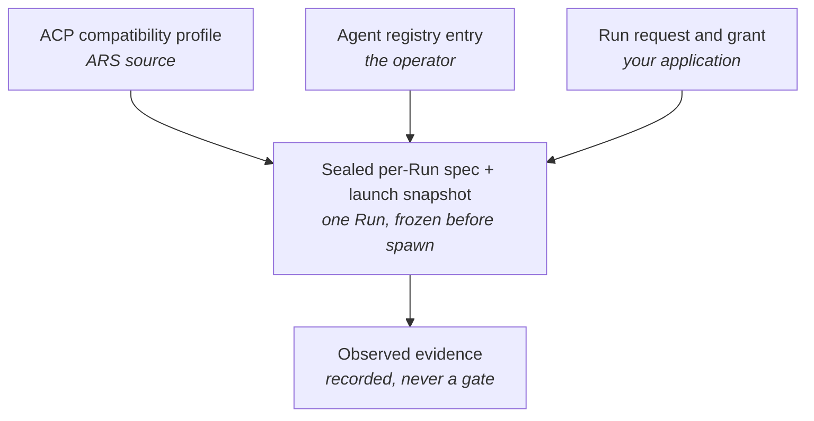

# Core concepts

Five ideas carry the whole model. Read them in order the first time; after that
each page stands alone.

| Concept | The one-line version |
|---|---|
| [Agents](agents.md) | An *agent* is a command an operator registered, named by an `agent_id` a caller can use. |
| [Runs and Sessions](runs-and-sessions.md) | A Run is one supervised execution and terminates. A Session is durable continuity and does not. |
| [Profiles and binding](profiles-and-binding.md) | A profile says *how to speak ACP*; a registry entry says *which command is that agent here*; a grant says *what this Run may do*. |
| [Native ACP](native-acp.md) | ARS drives the agent over ACP Protocol v1 on stdio, and normalizes what comes back. |

## How the four authority layers fit together

Nothing in ARS is decided in one place. Four layers own four different
questions, and keeping them apart is what makes an agent upgrade cost nothing:

| Layer | Owner | Carries |
|---|---|---|
| ACP compatibility profile | ARS source | how to speak ACP to a class of agent: protocol major, required and forbidden capabilities, session semantics, selector conventions, the base environment allowlist |
| Agent registry entry | you, the operator | which command is that agent here, its argv, its environment declarations, its selector hints, its capability narrowing |
| Sealed per-Run spec | one Run | the projection of profile × entry × request, taken once before the process starts |
| Observed evidence | one Run | what was resolved and observed — recorded, never a gate |

A profile contains no path, version, digest, model literal, agent name, or
deployment fact. An entry contains no capability requirement, protocol version,
or mediation pair. Callers supply none of either: `command`, `args`, environment
keys and values, paths, and secret values are **not fields on the wire**.

!!! contract "Why the split matters to you"

    Because no identity field derives from what the agent turned out to be, an
    **agent upgrade behind an unchanged registered command costs nothing** — no
    restart, no re-acceptance, and existing Sessions still resume through a real
    `session/load`. A change to the registry file itself costs exactly one
    daemon restart, because the registry is read once at startup and never
    re-opened while serving.
