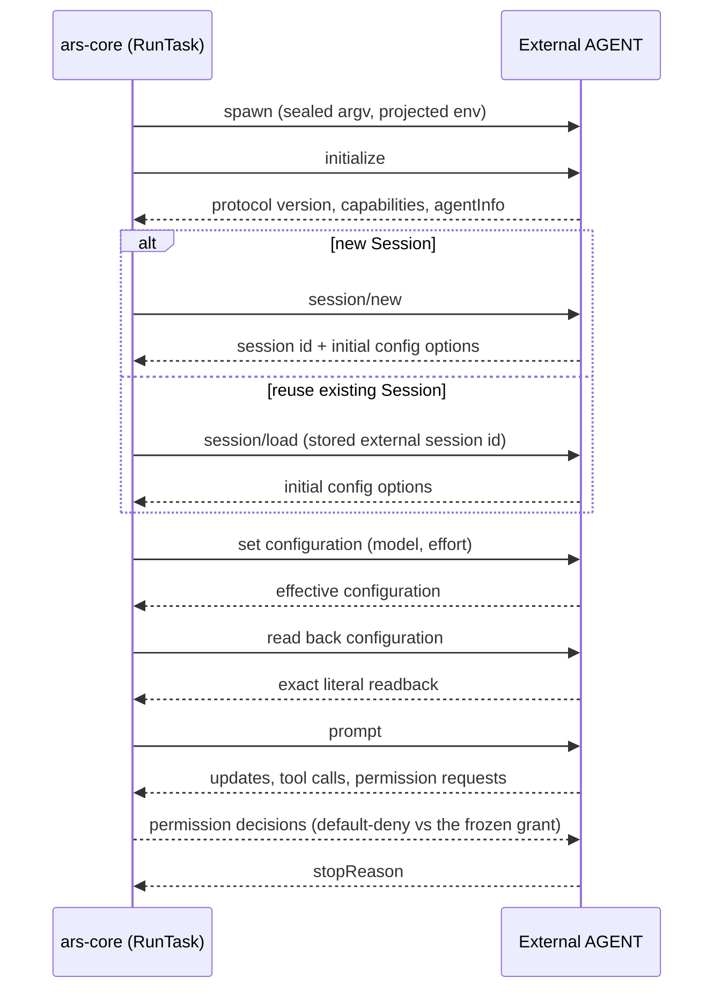

# Native ACP

Downstream, ARS speaks **ACP Protocol v1** over stdio JSON-RPC to the agent
process. There is one runtime — `arsd` + ars-core + Native ACP — and one
transport. v1 is stdio by definition, which is why the registry has no
`transport` field: a one-valued key would be scaffolding for a capability that is
not designed.

## What one Run does over the wire



`session/new` returns the newly minted external session id plus initial config
options. `session/load` receives the stored external session id from ARS and
returns initial config options, not a replacement session id.

The order is load-bearing. Configuration is proven **before** any prompt, so a
Run that cannot prove its configuration never dispatches one.

## Contract checks inside one Run

Five observation-based refusals exist, and they are the complete set:

| Refusal | Cause |
|---|---|
| `PROTOCOL_MISMATCH` | the agent's protocol major disagrees with the profile's frozen major |
| `CAPABILITY_MISSING` | a capability the profile requires is absent |
| `CAPABILITY_FORBIDDEN` | a capability the profile or entry forbids is present |
| `CONFIG_FIDELITY` | configuration readback was inexact or coerced |
| permission-mode not proven | on a compatibility profile, a required permission mode was not proven by readback |

These are checks against a declared contract *inside one Run*. They are not
continuity comparisons between Runs — drift across Runs is recorded, never
refused.

## Model and effort domains are live

Whatever the running agent advertises **right now** is the authority, and exact
literal readback is the proof.

- The caller supplies `requested_model` and `requested_effort` on every Run.
- A value the agent does not advertise yields zero turns and no prompt.
- If the agent advertises or reads back an id that is not byte-for-byte the
  requested one, the Run fails pre-dispatch with `CONFIG_FIDELITY`, before any
  prompt — rather than proceeding as though the pin had been proven.

This is why "the agent added a model today" is a non-event for ARS, and why
`model_selector` and `effort_selector` in the registry carry an id *hint* only,
never a value domain.

!!! warning "Rolling aliases are not pins"

    Some agents expose alias model ids that the provider re-points over time. An
    alias is the provider's currently recommended model in a lane, not a
    permanent synonym for a concrete generation. A caller that needs a fixed
    model must request the **full concrete model id**, exactly as it expects to
    read it back — and the running agent must actually advertise that id.

## The normalized event stream

ARS does not hand you raw agent output. Each Run gets one writer, a monotonic
`seq` starting at `1`, bounded queues, and explicit truncation markers. Each line
carries a `type` and a small allow-listed set of structural fields — never bulk
content, and never raw agent text beyond the bounded, redacted fields the writer
is given.

One event family exists purely to report an observation without changing an
outcome:

```json
{
  "type": "policy_warning",
  "code": "AGENT_SELF_REPORT_CHANGED",
  "subject": "agent_self_report",
  "comparison": "previous_run_of_session",
  "authoritative": false,
  "refused": false
}
```

`authoritative` and `refused` are always `false`. A policy warning contains no
free-form text at all: it names *which* non-authoritative fact drifted, never
what the fact was. Do not treat one as a failure signal, a business verdict, or
grounds to retire a Session — no ARS code path branches on one either.

Full shapes: [Events](../reference/events.md) and [Results](../reference/results.md).

## Session continuity is real

Reuse loads the agent's own Session through a real `session/load`. ARS never
repoints an agent's configuration root, so agent-owned Session state stays where
the agent put it. That is what makes continuity survive an agent upgrade behind
an unchanged registered command.

The external AGENT session id ARS observes is recorded as the agent minted it,
and is never projected back to a caller. The identifier you use is the durable
ARS `session_id`.
