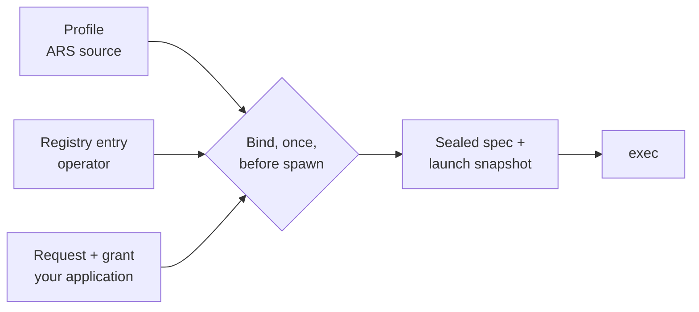

# Profiles and binding

Three separately owned things bind together, once, before a Run's process
starts. After that the Run is sealed and cannot be re-pointed.

## The profile: how to speak ACP

A profile answers exactly one question — *how do you speak ACP to a class of
agent?* It freezes the protocol major, the required capabilities, a
forbidden-capability floor, session semantics including a required real
`session/load`, the selector-id conventions, the base environment allowlist, and
permission-mediation semantics.

It freezes nothing else. There is no path, version, digest, model literal, agent
name, value domain, or deployment fact in a profile, because none of those is an
ACP semantic.

Three profiles are registered:

| Profile id | Exists because |
|---|---|
| `standard-native-acp-v1` | the ACP-v1 conformance contract every standards-conforming agent runs under |
| `claude-agent-acp-compat-v1` | one adapter carries a cited ACP-semantic deviation: it resolves its initial permission mode from ambient settings and auto-allows tool calls while that mode is permissive, so the mode is frozen as a config selector and proven by exact readback before any prompt, and the frozen session metadata removes the ambient setting sources |
| `cursor-native-acp-v1` | an agent whose model selector *is* the whole configuration, with no independent effort selector to discover or set, plus a grant-driven permission-mode selector |

The `-v1` suffix is load-bearing: the id carries the ACP protocol generation, and
a future `standard-native-acp-v2` would be a separate profile with its own
registry entries and its own Sessions.

!!! note "`effort_selector` is refused on a model-only profile"

    `cursor-native-acp-v1` declares model-only configuration fidelity, so ARS
    discovers no effort selector, sets none, and reports `N/A` as the effective
    effort. A caller targeting such an agent must request effort `N/A`; any other
    value fails before the prompt. An effort selector hint for a selector no Run
    ever sets would be a fiction in every launch snapshot, so the pairing is
    refused rather than ignored.

## The registry entry: which command is that agent here

Covered in [Agents](agents.md) and the [agents file
reference](../reference/agents-file.md). What matters for binding: the entry
selects a profile and may *narrow* it — `forbidden_capabilities` is applied as a
superset of the profile's own floor — but it can never widen one.

## The grant: what this Run may do

Your application freezes a grant into each Run: `grant_ref`, `grant_hash`,
`grant_role_hash`, and `grant_capabilities`, plus evidence and recovery policy
hashes. The grant is immutable for the life of that Run. Every ACP permission
request the agent makes is decided against it, default-deny, and every decision
is recorded as redacted evidence.

## Permission mediation, exactly

Mediation environment values route an agent's privileged in-process tool families
through ACP permission requests, so the permission bridge decides **before** a
side effect rather than after one.

Because that is load-bearing, the binding is closed:

- **Source-owned in key and value**, keyed by the capability family it mediates.
  Your entry may *select* one id, or none. It can never author a pair, a key, or
  a value, and there is no `mediation = off`.
- **Reserved keys are global** — the union of every key in *any* registered
  binding, not only the one you selected — so the rule does not depend on your
  choice.
- **A collision refuses startup.** If any entry's `env_overlay` contains a
  reserved key, or its `env_passthrough` names one, the parse fails with
  `MEDIATION_KEY_COLLISION` and the daemon refuses to listen. `agents validate`
  applies the identical check offline.
- **Mediation is applied last** among the layers you can influence, as defense in
  depth: a defect in the collision check cannot silently disable it.

Some agents complete a side effect without ever asking over ACP. Where cited
evidence shows that, a profile additionally selects a **launch-permission
policy**: ARS writes a private per-Run configuration before the process starts
and points the agent at it. You do not select it and cannot author or disable it.
You will see the reserved **name** in the Run's launch projection with source
class `launch_permission`; the value is withheld like every other value.

!!! danger "Mediation is cooperative"

    ACP permission mediation is cooperative policy enforcement, not an OS
    sandbox. The agent runs as the daemon's user with that user's full authority
    over the filesystem, network, and process table.

    An agent that ignores the mediation knob, or one with no registered binding,
    can execute in-process tools with **no ACP permission event at all**, and the
    bridge will never see them. Zero permission events prove nothing about
    denial.

    The mandatory **denied-action canary** proves the knob works for one specific
    agent, and it must precede that agent's use. Run it after `agents doctor` and
    before you put the agent into service.

## Where real isolation belongs

Outside ARS, at the OS layer: a dedicated UID per agent, user namespaces,
`seccomp`/Landlock, `bwrap`/container/VM boundaries, cgroup resource limits,
network namespaces.

These compose with ARS because `command` is opaque to it — register the isolation
wrapper as the command. The difference between two kinds of wrapper is worth
knowing:

| Wrapper style | Consequence |
|---|---|
| a wrapper that `exec`s into the payload | keeps the payload in ARS's process group; termination and timeout guarantees compose cleanly |
| a wrapper that *relocates* the payload to another supervisor, namespace, or cgroup | breaks ARS's termination and timeout guarantees; if work continues elsewhere the Run fails loudly as `unknown` / quarantined |

Both are permitted. The difference is stated so the choice is yours knowingly —
ARS makes no isolation claim either way.

## Honest limits

1. **Not a sandbox.** `allowed_roots` constrains what ARS *approves via ACP*, not
   what the process *can do*.
2. **No supply-chain or integrity claim.** ARS does not verify that the
   executable it launched is the one you intended or is unmodified.
3. **No hostile-code containment.** An agent that spawns its own children, writes
   outside the workspace, or exfiltrates data is not stopped by anything here.
4. **Unmediated in-process tools are invisible** to the permission bridge.
5. **Registry trust is transitive to you.** A wrong `command` launches the wrong
   thing. The defenses are that the registry is operator-authored rather than
   caller-supplied, read-only to ARS, refused when world-writable, parsed once,
   and fully recorded per Run.
6. **Termination reaches the process group ARS created** — not a descendant that
   calls `setsid()`, a payload handed to a service manager as a separate
   transient unit, or an agent that double-forks.
