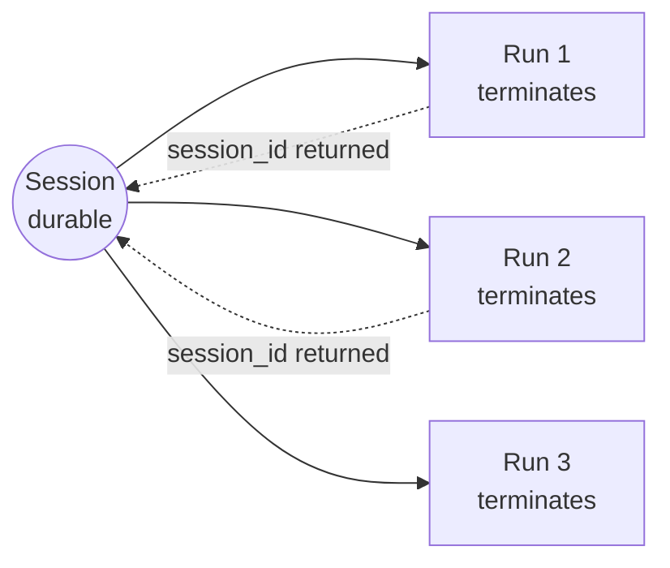

# Runs and Sessions

This is the single most important page on the site. Getting the two confused
produces callers that leak conversations, retry things they must not retry, or
wait forever for a state change that never arrives.

**Runs terminate. Sessions do not.**

## A Run

A **Run** is one supervised execution: one process, one immutable spec sealed
before the process starts, one frozen grant, one normalized event stream, and
exactly one terminal result.

A Run always reaches a terminal. The vocabulary is five values and deliberately
nothing beside it:

| `status` | `error_code` | `retryable` default | Meaning |
|---|---|---|---|
| `completed` | `null` | `false` | the turn finished with a completed-class stop reason |
| `failed` | `FAILED` | `false` | the Run ended unsuccessfully |
| `cancelled` | `CANCELLED` | `false` | a cooperative cancel was observed |
| `timed_out` | `TIMED_OUT` | `true` | a supervisor limit was reached |
| `unknown` | `UNKNOWN` | `false` | the outcome is not trustworthy |

`unknown` is the load-bearing one. A prompt that may have been dispatched
without a trustworthy terminal ends `unknown` / `retryable = false`, with its
Session quarantined. It is never replayed, resumed, or retried automatically.

Supervisor status is never a business verdict: `business_verdict` is always
`null` and belongs to your application.

## A Session

A **Session** is durable conversation continuity across Runs, owned by the
authenticated identity that created it.

A Session is durable and resumable indefinitely. It has no normal close, no
expiry, and no terminal lifecycle state — there is no open, active, or closed
value to read, no one-shot variant, and no operation on the wire or in the client
that would retire one. A Run reaching a terminal never ends it.



## Creating versus reusing

The whole choice is one field on the request:

| `session_id` | Behaviour |
|---|---|
| **key omitted** | atomically create one new durable Session and run its first Run |
| an existing Session id | reuse that Session, existing-only — it can never fall back to creating one |
| present, but `null` | **refused** with `INVALID_REQUEST` |

Omitting the key and sending `None` are not the same statement. Absent says "I
have no Session"; a present null says "my Session is the null value", which is
not a Session. Refusing it is what stops a caller whose id-producing code
returned `None` from silently starting a second conversation.

```python
# First Run: omit the key entirely.
ack = client.submit(request_id="req-1", payload={"request": {
    "agent_id": "my-agent",
    # no "session_id" key at all
    ...
}, "prompt_text": "...", "workspace_root": "..."})

# The terminal result carries the session_id this Run used.
session_id = client.run_status(ack["run_id"])["result"]["session_id"]

# Next Run: name it. Reuse is existing-only.
client.submit(request_id="req-2", payload={"request": {
    "agent_id": "my-agent",
    "session_id": session_id,
    ...
}, "prompt_text": "...", "workspace_root": "..."})
```

Continuity is real, not simulated: a new process loads the same Session through
a real `session/load` and continues at the same effective model and effort.

## What can stop reuse — and why none of it is a lifecycle

Quarantine, the concurrency lease, and retention are orthogonal concerns. None
of them is a Session lifecycle.

=== "Concurrency lease"

    A live lease means **one Run at a time** for a Session. A second concurrent
    `submit` against a leased Session is refused with `SESSION_BUSY`. The lease
    is released when the Run terminates; it says nothing about whether the
    Session is reusable afterwards, and it is not a state you close.

=== "Quarantine"

    Quarantine is **durable evidence that continuity was proven unsafe** — for
    example a prompt that may have been dispatched without a trustworthy
    terminal. Its record is `{reason_code, source_run_id, recorded_at}`, with
    `reason_code` drawn from a closed source-owned vocabulary: never an
    exception message, never agent-authored text, never a path.

    There is no unquarantine tool. Continuing that work means a new Session with
    caller-owned context handoff.

=== "Retention"

    Retention governs how long artifacts stay on disk under the supervisor root.
    It is storage hygiene applied to evidence, decided by the operator, and
    entirely separate from whether a Session can be reused.

=== "A continuity cut you asked for"

    An operator can add or bump `session_epoch` on a registry entry to stop
    reuse for that agent's existing Sessions. Identity comparison is symmetric
    equality, so a record at epoch 1 is refused by a Run at epoch 2 *and* by a
    Run with no epoch. No automatic bump exists anywhere — only an operator edit
    changes it.

## What a Session projection actually contains

`session_status` and `session_list` are both owner-scoped and expose no
synthetic lifecycle state, because none exists:

| Field | Type | Meaning |
|---|---|---|
| `session_id` | `string` | the durable ARS Session identifier |
| `owner`, `namespace` | `string` | the authenticated identity the Session belongs to |
| `agent_id` | `string` \| `null` | the registered agent this Session binds |
| `profile_id` | `string` \| `null` | the source profile identity |
| `created_at`, `updated_at` | `string` \| `null` | creation and last-use timestamps |
| `last_effective_model`, `last_effective_effort` | `string` \| `null` | the last exact-readback-proven pair |
| `quarantine` | `object` \| `null` | `{reason_code, source_run_id, recorded_at}`, else `null` |

The external AGENT session id is never projected.

## What does not invalidate reuse

Stated positively, because the list is long and the guarantee is the point: an
agent CLI or adapter version change; a self-reported name or version change; the
observed executable, mapped image, or path-lookup hit; capability drift between
Runs; a `command` path change from a repointed shim or a reinstall; an `args`,
overlay, pass-through, mediation, or selector edit; the registry file's bytes,
digest, mtime, or location; and any ARS release that does not change ACP
semantics.

!!! contract "Writing a caller against this"

    - Keep the `session_id` from a Run's terminal result; it is the handle for
      everything after the first Run.
    - Serialize your own Runs per Session, or handle `SESSION_BUSY`.
    - Treat `unknown` as terminal and non-retryable. Do not resubmit the prompt.
    - Check `quarantine` before assuming a Session is still reusable.
    - Do not build a "close" or "expire" step into your caller. There is nothing
      for it to call, and nothing that needs it.
