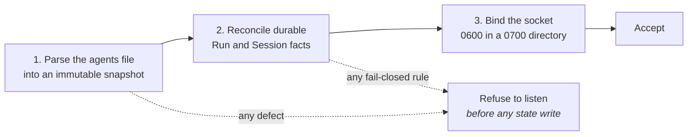

# Deployment

`arsd` is a single unprivileged user-level daemon. There is nothing to cluster,
no database, and no ingress to expose.

<a class="ars-panel" href="local-daemon.md">
  
Local daemon

  
Flags, the supervisor root, the socket, caller mappings, and startup order.

</a>

<a class="ars-panel" href="systemd.md">
  
Service manager

  
Rendering a user-scope unit, and the cgroup properties crash containment depends on.

</a>

## What the host must provide

| Need | Requirement |
|---|---|
| Operating system | Linux with a POSIX user session, for the `AF_UNIX` socket |
| Python | ≥ 3.11. The runtime has zero third-party dependencies |
| Driving a real agent | the `native` extra, pinning the official ACP client |
| Identity | an unprivileged user. `arsd` **refuses to run as root** |
| State | a supervisor root directory it owns |
| Configuration | an agents file at an **absolute** path, and at least one caller mapping |
| Crash containment | a user-level service manager cgroup, and a CPython build with pidfd support |

## The two writable surfaces

ARS writes to exactly two places: the **supervisor root** and the **socket
path**. Everything under the supervisor root is `0700` directories and `0600`
files, written atomically at the final step.

Everything else on the host belongs to somebody else. In particular the agent's
`HOME`, its credential store, its plugin tree, its caches, its configuration,
and its own conversation store are agent-owned; ARS reads none of them and
repoints none of them.

## Startup order is fail-closed and strictly sequential

After step 1 the registry is **never opened again** for the daemon's whole
lifetime. The Run, spawn, finalization, and reconciliation paths perform zero
registry filesystem access, two concurrent Runs can never resolve different
registry contents, and a serving daemon cannot be re-pointed.

Reconciliation is stricter than a tolerant reader. A corrupt terminal record,
unattributable uncertainty, corrupt spec or launch material, a launch record
without its spec, or a corrupt submission on an otherwise empty Run tree each
refuse to listen — after any outcome-mandated quarantine side effect. A Run that
may have been dispatched without a trustworthy terminal result ends `unknown` /
quarantined / `retryable = false`.

## Restarts

A restart is a **service action**, not a promotion. It performs no measurement,
writes no acceptance receipt, and invalidates no Session — no Session identity
field derives from registry bytes, mtimes, digests, command paths, or observed
runtime facts.

You restart when the registry file itself changes. You do **not** restart for an
agent upgrade behind an unchanged registered command; that costs nothing at all.

## What deployment does not include

!!! warning "Each of these is a separate, explicit decision"

    Installing an artifact, writing production configuration, enabling or
    restarting a service, cutting a caller over, publishing a release, and
    deploying anything are separate operator decisions. None of them follows from
    reading this documentation, and none of them is implied by a green build.

    This site documents how ARS works. It is not a deployment-status board and
    records nothing about any particular installation.
