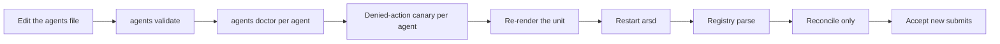

# Service manager

ARS can render a user-scope `systemd` unit for you. Rendering is pure text: it
writes no file, installs nothing, enables nothing, and starts nothing.

## Render the unit

```bash
python3 -m agent_run_supervisor.arsd \
  --agents-file /absolute/path/to/agents.toml \
  --print-service-unit
```

`--agents-file` must be an **absolute** path here too. The same check runs in
both modes deliberately, so a rendered unit can never carry a path the daemon
would reject at startup.

Review the output, then install it wherever your user-scope units live. That
step is yours: reviewing a rendered unit and choosing to install it are different
decisions, and ARS only does the first.

## What the unit has to carry

Two properties are load-bearing for crash containment, and they are the reason a
service manager is expected in production at all:

| Property | Why |
|---|---|
| `Restart=on-failure` | a daemon that dies mid-Run comes back and reconciles durable facts fail-closed, rather than leaving the tree unattended |
| `KillMode=control-group` | the service cgroup reaches descendants that escaped ARS's process group but remain in that cgroup — for example a double-fork or `setsid()` |

ARS terminates its own process group reliably. The service cgroup closes that
gap only for descendants that remain inside it, and it lives outside ARS. A
payload relocated to another supervisor, namespace, or cgroup is outside both
guarantees; that uncertainty fails the Run loudly rather than being hidden.

!!! warning "Keep deployment values out of the repository"

    The unit file carries the registry path, the supervisor root, the socket
    path, and your caller mappings. Those are facts about one installation.
    Store the unit at mode `0600`, and keep runtime values in a local
    environment file that version control ignores. Use `[REDACTED]` when
    quoting one in a document.

## Environment for the daemon

A user-level service inherits a minimal environment, and everything the agent
sees is projected from the daemon's own environment plus your registry
declarations. That is why `PATH` is the single most common cause of "works in my
shell, fails under ARS".

Two remedies, both explicit:

- set a `PATH` the daemon itself has, in the unit's environment; or
- author `env_overlay.PATH` on the registry entry, or register an absolute
  `command`.

`agents doctor --no-probe` reports the exact projected **name** set, so the gap
is visible rather than mysterious.

## Restart discipline



Restarts recur only when the registry itself changes. Drain in-flight Runs
first: a restart is a service action, and it invalidates no Session.

!!! contract "What a restart is not"

    It is not a promotion, a measurement, an acceptance receipt, or a
    re-canary. Nothing about restarting `arsd` authorizes installing an
    artifact, cutting a caller over, publishing a release, or enabling a
    service. Each of those is a separate, explicit operator decision.

## Verifying a running daemon

`arsd` has no health endpoint, because it has nothing to expose one on. Use the
socket you already have:

```python
from agent_run_supervisor.arsd.client import ArsdClient

with ArsdClient("<socket-path>") as client:
    print(client.server_info())
```

`server_info` is a normal operation and, like every other operation, requires
`api_version` on the request envelope.
