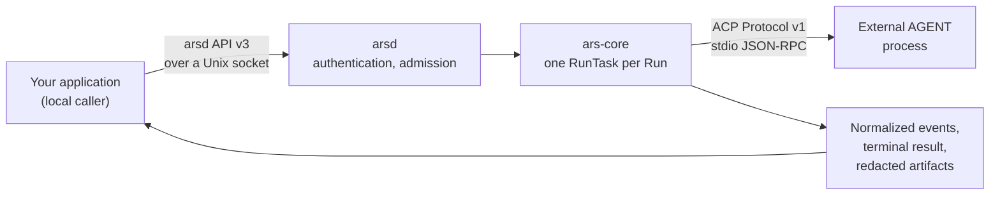

# Overview

Anything that drives an external coding AGENT rebuilds the same plumbing: launch
the agent process, babysit it, decide what it may touch, read a stream of
protocol events, work out how the run really ended, and scrub secrets before
anything hits disk. Written ad-hoc, every caller grows its own copy.

**Agent Run Supervisor (ARS)** is that layer, factored out and kept local. Your
application submits a Run — which registered agent, which model, which
workspace, which prompt — and gets back auditable evidence instead of
process-lifecycle code: *what did the agent try to do, what was it allowed to
do, how did it end?*

## The shape of the system

```text
trusted local caller  →  arsd (local UDS)  →  ars-core / Native ACP  →  external AGENT process
```



Three stages, all on one machine and under one unprivileged user:

1. **`arsd` starts.** It parses the agent registry exactly once, reconciles
   durable Run and Session facts, and only then binds its socket. Any registry
   defect refuses to listen before anything is written.
2. **Your application connects** to a `0600` socket inside a `0700` directory.
   `arsd` authenticates the peer's credentials, maps them to a principal, and
   keys admission on your own `request_id`, which doubles as the idempotency
   key. Runs and Sessions are owner-scoped.
3. **`ars-core` runs the work.** One in-process `RunTask` owns one supervised
   process and one Native ACP connection, driven by an immutable spec sealed
   before the process starts. No command, argv, or environment value ever comes
   from the wire, and the registry is never re-read while serving.

Back over the same socket come normalized `seq`-ordered events, a
supervisor-owned status, and redacted local artifacts.

## Two protocols, two version lines

Neither implies the other.

| Direction | Protocol | Version rule |
|---|---|---|
| Downstream, to the agent | ACP Protocol v1 over stdio JSON-RPC | frozen by the profile the agent's registry entry names |
| Upstream, from your application | the ARS-owned `arsd` API v3 | every *request* envelope carries `api_version`; anything other than `3` is refused rather than guessed |

Result and error frames carry the correlating `request_id`, not a version. There
is no drain window, dual protocol, or alias — v3 is a clean cutover.

## What ARS owns

- **The process it starts.** PID and process group, timeouts, signals, and the
  reap. Termination reaches its direct child and every descendant still in the
  process group ARS created.
- **The ACP conversation.** Capabilities, the exact model and effort proven by
  literal readback before any prompt, and Session continuity through a real
  `session/load`.
- **Permission mediation** against the grant your caller froze into the Run,
  default-deny, with redacted evidence for every decision.
- **Deterministic redacted artifacts:** `0700` directories, `0600` files, atomic
  final writes, and exactly two writable surfaces — the supervisor root and the
  socket path.
- **Caller authentication** over the local socket, and owner scoping on every
  Run and Session.

## What ARS does not own

ARS supervises external ACP AGENTs it does not own. It does not install,
package, or upgrade that software, and it does not own an agent's home
directory, credentials, plugins, caches, configuration, or conversation store.
Those stay exactly where the agent puts them, which is what makes an agent work
under ARS the same way it works when you run it by hand.

Four more boundaries, stated as flatly as they deserve:

- **Not a sandbox.** ACP permission mediation is cooperative policy enforcement,
  not an OS sandbox. The agent runs as the daemon's user with that user's full
  authority over the filesystem, network, and process table. An agent that
  ignores mediation, spawns its own children, or writes outside the workspace is
  not stopped by anything in ARS. Real isolation belongs at the OS layer and
  composes here — register the isolation wrapper as the command.
- **No integrity or supply-chain verification.** ARS does not check that the
  executable it launched is the one you intended or came from a trusted
  publisher. There is no ownership, mode, ancestor, symlink, or digest check on
  the registered command.
- **No credential management.** ARS resolves, mints, refreshes, and stores no
  credential. Agents authenticate through their own stores under their own
  `HOME`. A `credential_refs` entry on a request is a *reference* recorded as
  admission evidence and never resolved to a value.
- **No business verdict.** `business_verdict` is always `null`. Supervisor
  status is a technical supervision fact, never a pass/fail judgement about the
  work.

!!! warning "No public network service"

    ARS exposes no public network service and no web console. Ingress is one
    local `AF_UNIX` socket, owned by an unprivileged user, with peer credentials
    authenticated on every connection. There is no TCP listener, no gateway, no
    chat integration, and no hosted dashboard — this documentation site is the
    only thing ARS publishes on the web.

## Fail-closed by default

Uncertainty is never resolved optimistically:

- A prompt that may already have been dispatched without a trustworthy terminal
  ends as `status = unknown`, `retryable = false`, with its Session
  quarantined. It is never replayed, resumed, or retried automatically, and
  there is no unquarantine tool.
- A corrupt terminal record, unattributable uncertainty, or a launch record
  without its spec each refuse to let the daemon listen at all.
- A registry defect refuses startup as a whole file. It is never partially
  honored, cached from a previous start, or repaired.

## Requirements

| Need | Requirement |
|---|---|
| Runtime | Python ≥ 3.11, with zero third-party runtime dependencies |
| Driving a real agent | the `native` extra, which pins the official ACP client `agent-client-protocol==0.12.1` |
| Running `arsd` | Linux with a POSIX user session for the `AF_UNIX` socket, a supervisor root, an agents file, and at least one caller mapping you supply |
| Running an agent | the agent installed by you, plus one registry entry naming its command |

Crash containment additionally expects a user-level service manager cgroup and a
CPython build with pidfd support — see [Deployment](deployment/index.md).

## Where to go next

- [Quickstart](quickstart.md) — a first local Run in about five minutes.
- [Core concepts](concepts/index.md) — Agent, Run, Session, profile and binding,
  Native ACP.
- [How-to guides](how-to/index.md) — registering specific local agents.
- [Reference](reference/index.md) — the socket API, the agents file, events,
  results, and error codes.
